### HTTP协议

http协议是 HyperText Transfer Protocol (超文本传输协议).是客户端和服务器端通信的一种协议.其中的客户端多指浏览器,作用于计算机网络4层模型中的应用层.是一种无状态,无连接的协议.

#### http请求一般由4部分组成:

请求行,请求头,空行,请求体.当请求类型为get请求时,没有请求体.

请求行:请求的方式,http协议的版本,资源路径.

请求头:各种协议信息.如host,accept,等等.

1.Accept请求头代表发送端（客户端）希望接受的数据类型。 比如：Accept：text/xml; 代表客户端希望接受的数据类型是xml类型。

2.Content-Type请求头代表发送端（客户端|服务器）发送的实体数据的数据类型。 比如：Content-Type：text/html; 代表发送端发送的数据格式是html

##### 请求类型

如何正确选择 Form 的 Content-type 类型？

x-www-form-urlencoded，表单默认的 Content-type 类型，支持 ASCII-text 文本内容
multipart/form-data，允许提交表单包含： files，non-ASCII-text，Binary 类型数据

###### application/x-www-form-urlencoded

当表单使用 application/x-www-form-urlencoded 时，需要对参数进行 urlencode 编码和序列化

如，表单提交参数（key-value）为：

param1:website
param2:https://www.google.com
经过 urlencode 编码后：

param1:website
param2:https%3A%2F%2Fwww.google.com
再经过序列化，得到结果

param1=website&param2=https%3A%2F%2Fwww.google.com

###### multipart/form-data

一个 multipart/form-data 消息体，包含多个块组成，每个块代表一个有效的表单控件，并使用 boundary 的字符串分割：

第一部分，Content-Disposition: form-data 参数名称，如，name="my_control
第二部分，Content-Type: text/plain，Content-Type: image/png
第三部分，消息内容
例如表单：

<FORM action="http://server.com/cgi/handle"
       enctype="multipart/form-data"
       method="post">
   

   What is your name? <INPUT type="text" name="submit-name"> 
   What files are you sending? <INPUT type="file" name="files"> 
   <INPUT type="submit" value="Send">
   <INPUT type="reset">
</FORM>
假设，submit-name 输入 Larry 文本，files 选择文件 file1.txt

Content-Type: multipart/form-data; boundary=AaB03x

--AaB03x
Content-Disposition: form-data; name="submit-name"

Larry
--AaB03x
Content-Disposition: form-data; name="files"; filename="file1.txt"
Content-Type: text/plain

... contents of file1.txt ...
--AaB03x--

3.connection: close关闭连接   keep-alive保持连接

条件式获取：

If-modified-since:

**`If-Modified-Since`** 是一个条件式请求首部，服务器只在所请求的资源在给定的日期时间之后对内容进行过修改的情况下才会将资源返回，状态码为 [`200`](https://developer.mozilla.org/zh-CN/docs/Web/HTTP/Status/200) 。资源改了，服务器返回最新的对象

如果请求的资源从那时起未经修改，那么返回一个不带有消息主体的 [`304`](https://developer.mozilla.org/zh-CN/docs/Web/HTTP/Status/304) 响应，而在 [`Last-Modified`](https://developer.mozilla.org/zh-CN/docs/Web/HTTP/Headers/Last-Modified) 首部中会带有上次修改时间。不同于 [`If-Unmodified-Since`](https://developer.mozilla.org/zh-CN/docs/Web/HTTP/Headers/If-Unmodified-Since), `If-Modified-Since` 只可以用在 [`GET`](https://developer.mozilla.org/zh-CN/docs/Web/HTTP/Methods/GET) 或 [`HEAD`](https://developer.mozilla.org/zh-CN/docs/Web/HTTP/Methods/HEAD) 请求中。资源没改，返回304响应。

当与 [`If-None-Match`](https://developer.mozilla.org/zh-CN/docs/Web/HTTP/Headers/If-None-Match) 一同出现时，它（**`If-Modified-Since`**）会被忽略掉，除非服务器不支持 `If-None-Match`。

最常见的应用场景是来更新没有特定 [`ETag`](https://developer.mozilla.org/zh-CN/docs/Web/HTTP/Headers/ETag) 标签的缓存实体。

空行:分隔请求头和请求体

请求体:post请求的数据

http响应:一般由4个部分组成

响应行,响应头,空行,响应体

其中有响应状态码,常见的有1开头的,其作用是: 这一类型的状态码，代表请求已被接受，需要继续处理。这类响应是临时响应，只包含状态行和某些可选的响应头信息，并以空行结束 

1XX,一百范围之间的状态码表示请求正在处理中。

200:请求成功,数据将随此响应返回.

301:永久重定向

302:临时重定向

403:权限不够,禁止访问.

404:请求的资源没有找到.

500:服务器内部错误

502: Bad Gateway错误是HTTP状态代码，表示Internet上的一台服务器收到来自另一台服务器的无效响应 

**`503 Service Unavailable`** 是一种 HTTP 协议的服务器端错误状态代码，它表示服务器尚未处于可以接受请求的状态。

#### 3.php可以通过header设置一些响应规则.当浏览器解析到响应头时会,设置的header会生效.

header('location:http://www.baidu.com');立即发起重定向请求,浏览器不会解析剩下的响应头和响应体.	

header('Refresh:3;url=http://www.baidu.com')  用来做提示跳转.比如页面3秒后跳转到某一个页面.

header('content-type:image/png') 让浏览器按照指定的格式解析内容,默认的格式是text.

使用如下的header设置,可以达到文件下载的功能.

#### 4.get和post请求有什么区别？

1.安全性的区别。get把请求数据直接放在url中传输，不安全，而post会放在请求体中传输，相对来说比较安全。

2.get请求传输的数据长度是有限制的（2048个字符），而post没有限制。

3.get请求传输的数据类型是有限制的，只能是ascii类型的数据，而post没有限制，也可以是二进制数据。

4.get请求会被浏览器缓存，而post不会。

5.get请求在浏览器回退的时候是无害的，而post会再次提交请求。

6.get和post在restful api规范中，get一般用来获取数据，而post一般用于修改数据。

#### 4.浏览器限制了，在同一个域名下，网站只能发起6～8个连接。

#### 4.http1.0

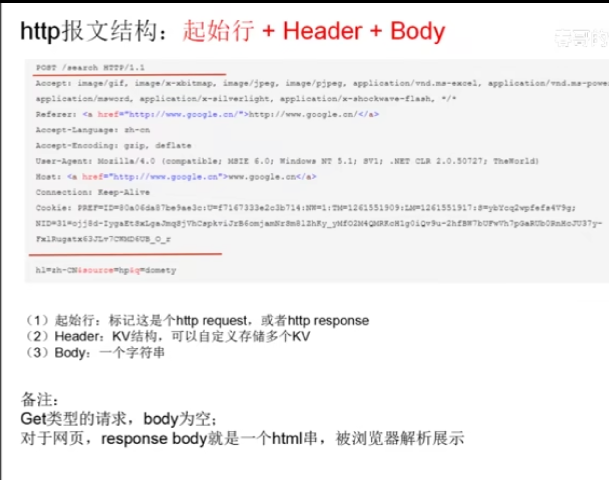

存在的问题，新增了一个keep-alive的请求头。

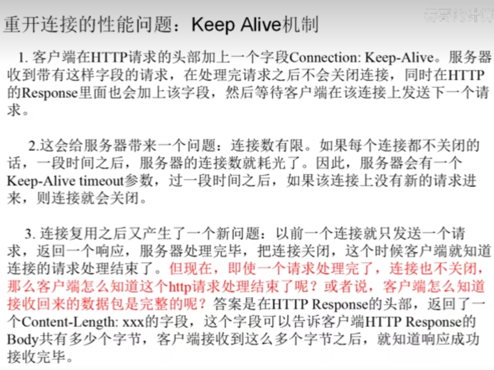

#### 5.http1.1

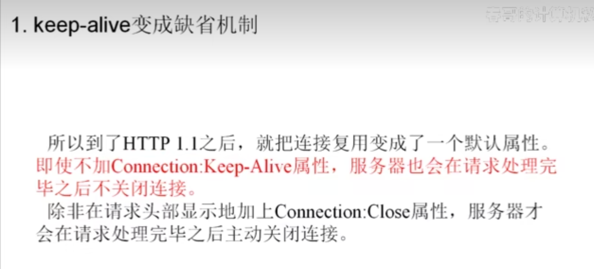

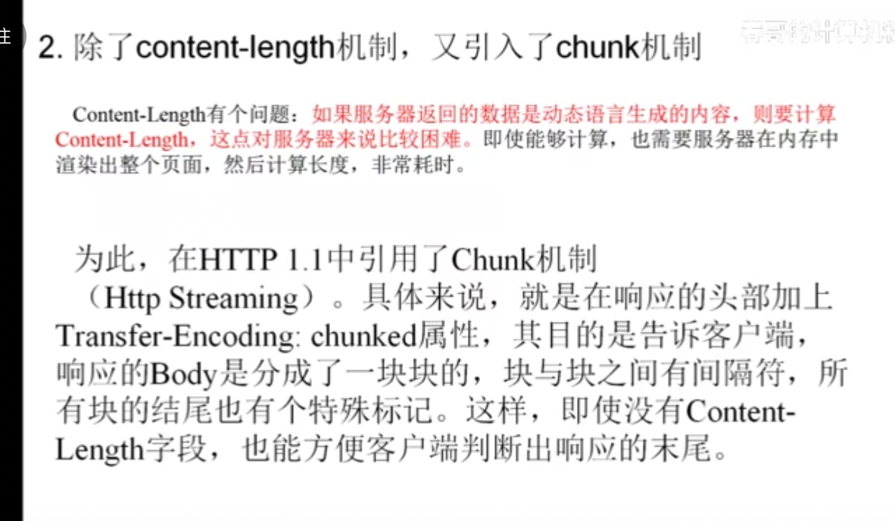

pipeline机制

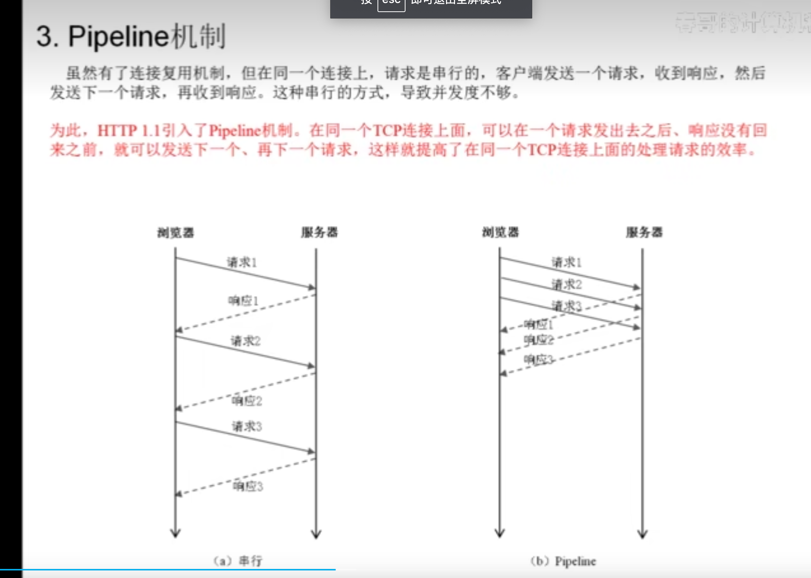

pipeline机制带来的问题。

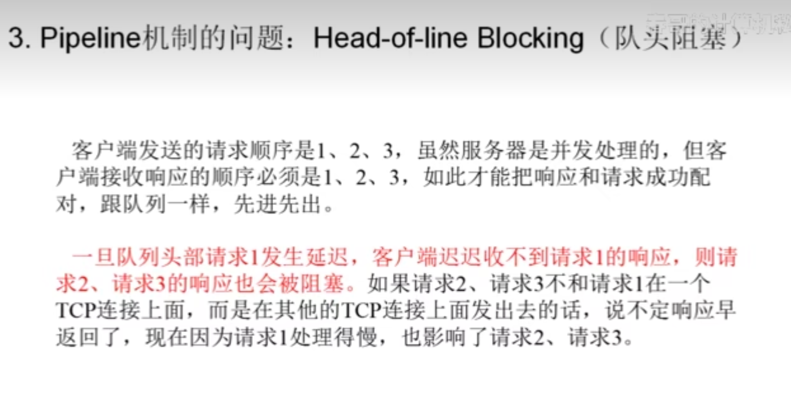

断点续传特性

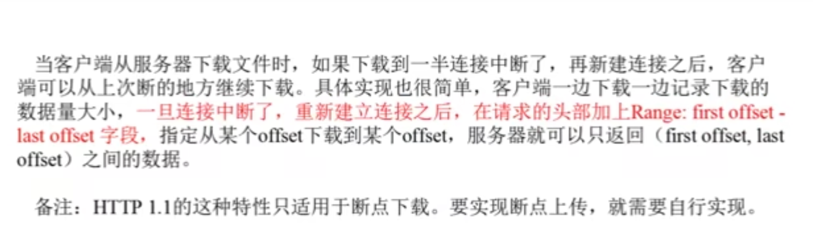

#### 6.http2.0

##### 1.兼容了http1.1，运行在http1.1之下的一个协议

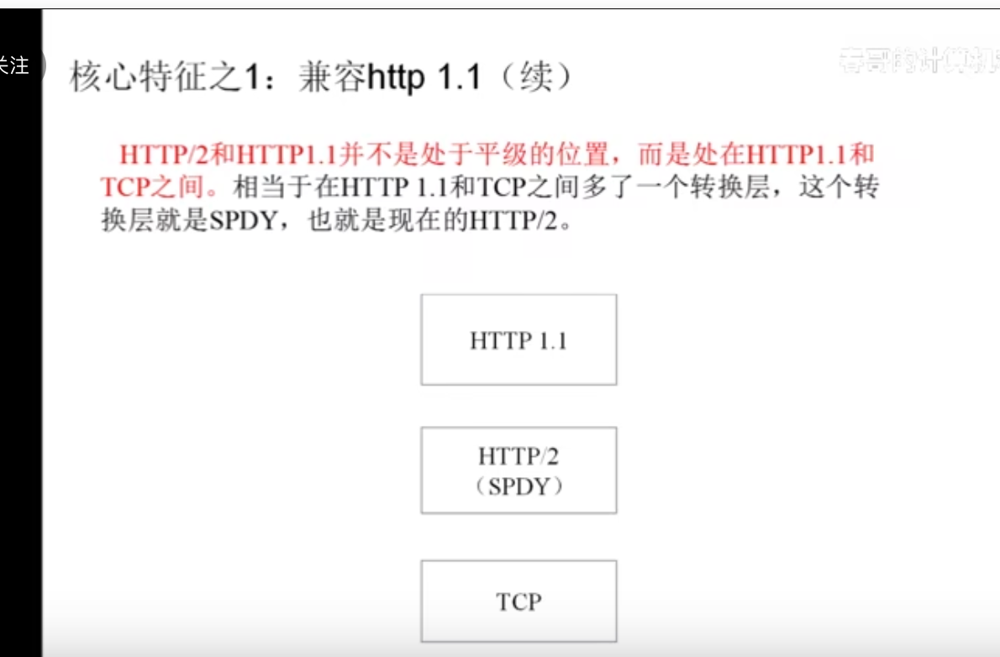

##### 2.HTTP/2 是二进制协议而不是文本协议。不再可读，也不可无障碍的手动创建，改善的优化技术现在可被实施。

##### 3.这是一个多路复用协议。并行的请求能在同一个链接中处理，移除了 HTTP/1.x 中顺序和阻塞的约束。

对于同一个域名下，浏览器和服务器之前，只维护一条tcp连接。

通过把数据包拆解成多个二进制包，进行传输。让多个请求，在同一个链接中发送。

发送时拆包，

接收时组装数据包，

每个数据包有对应的流水号去标识，所以每个数据包可以知道，属于哪个请求和响应。

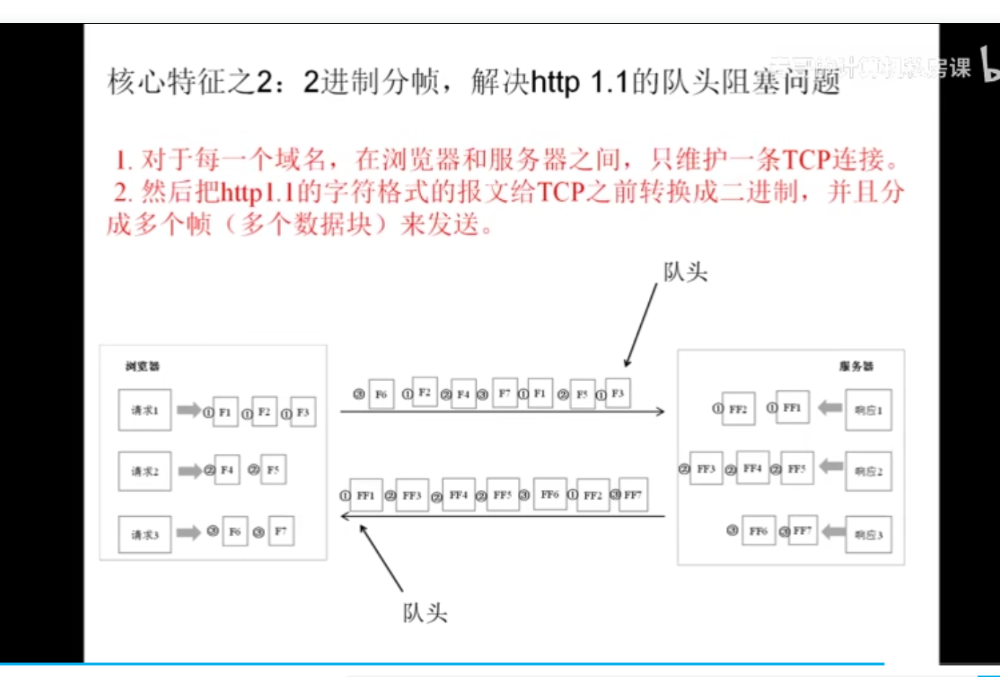

##### 4.压缩了标头。因为标头在一系列请求中常常是相似的，其移除了重复和传输重复数据的成本。

http2存在的缺陷

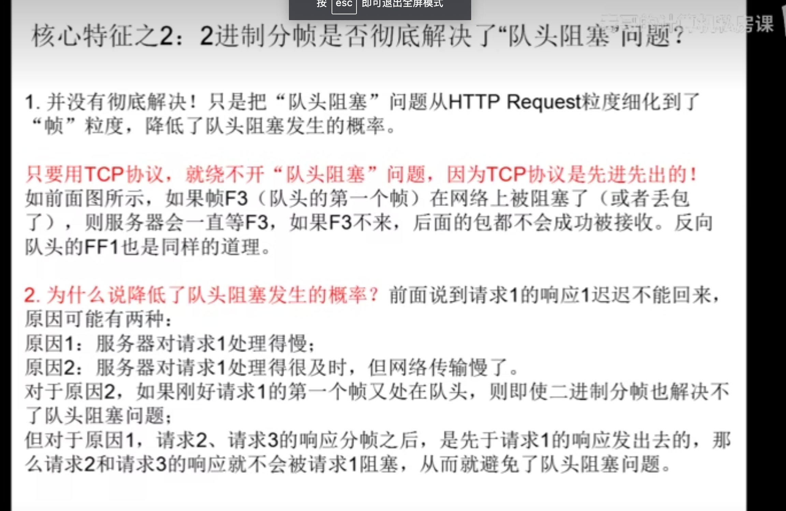

#### 7.如何升级为http2.0

https://blog.fundebug.com/2019/10/28/speedup-fundebug-by-using-http2/

### 什么是https协议？

具体链接：https://www.cnblogs.com/sxiszero/p/11133747.html

https是在http协议上，增加一层ssl协议。

HTTPS（全称：Hyper Text Transfer Protocol over Secure Socket Layer 或 Hypertext Transfer Protocol Secure，超文本传输安全协议），是以安全为目标的HTTP通道，简单讲是HTTP的安全版。即HTTP下加入SSL层，HTTPS的安全基础是SSL，因此加密的详细内容就需要SSL。 它是一个URI scheme（抽象标识符体系），句法类同http:体系。用于安全的HTTP数据传输。https: URL表明它使用了HTTP，但HTTPS存在不同于HTTP的默认端口及一个加密/身份验证层（在HTTP与TCP之间）。
众所周知，WEB服务存在http和https两种通信方式，http默认采用80作为通讯端口，对于传输采用不加密的方式；https默认采用443，对于传输的数据进行加密传输。目前主流的网站基本上开始默认采用HTTPS作为通信方式

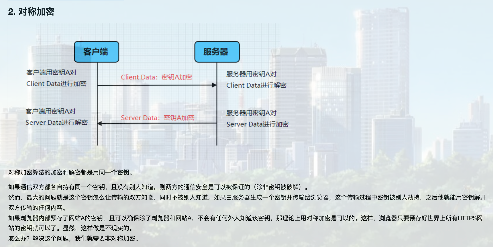

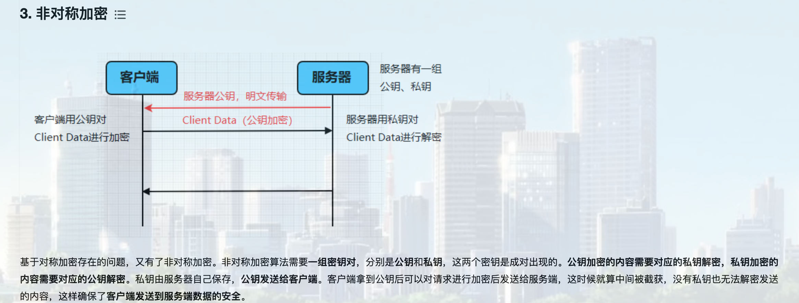

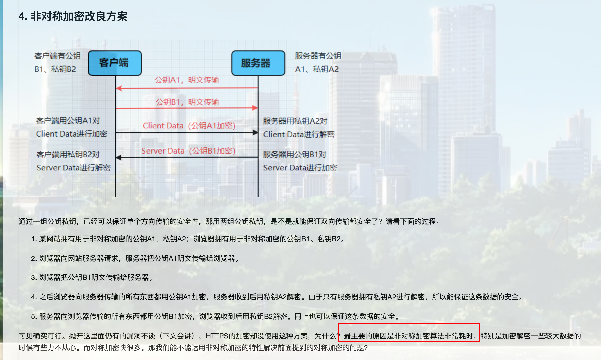

所以https不会用非对称性加密的公钥进行加密。太耗时了。而是改用了对称性加密的密钥。

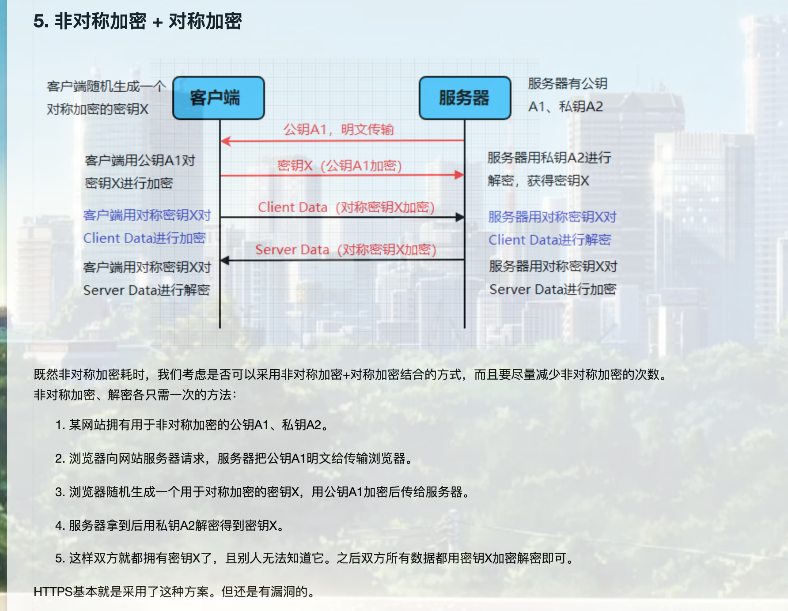

其实https机制就是采用了，对称加密和非对称加密结合的方式，来保证安全。

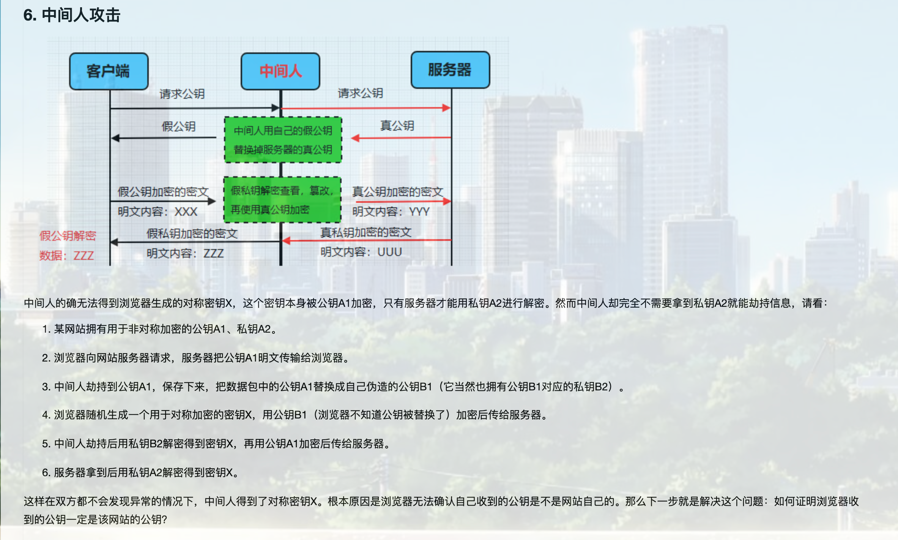

通过证书机制。

接收到服务器的证书后，和系统的ca证书进行对比。如果是可信的ca证书，就接收此次证书。

