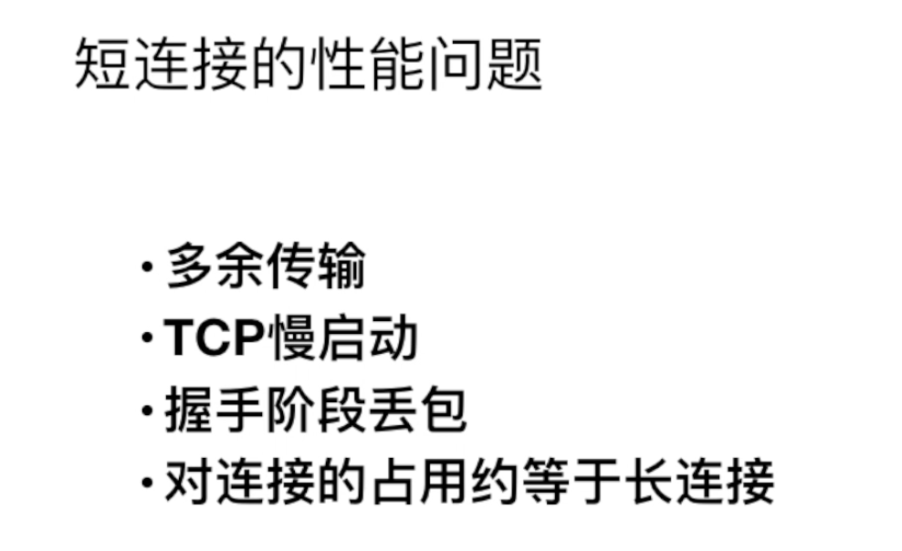

### 1.tcp/ip协议的四层模型


### 2.数据链路层

作用:将电信号0和1进行分组,并形成成有特定意义的数据帧,然后以广播的形式通过物流介质传送给接收方.

 

协议:以太网协议

一个完整的以太网数据包如下图,mac地址在首部存储


如何表示接收方呢?

通mac地址.mac的网卡的唯一标识.mac地址不会重复.以太网就会以广播 形式,将广播给子网内的所有主机.主机会匹配数据包中的mac地址,如果和自己的mac地址相同就接收并处理.不同就丢弃


### 3.网络层

网络层的主要工作是***\*定义网络地址，区分网段，子网内MAC寻址，对于不同子网的数据包进行路由。\**** 

协议:ip协议,arp协议,路由协议	

ip协议: IP地址分为五类，A类保留给政府机构，B类分配给中等规模的公司，C类分配给任何需要的人，D类用于组播，E类用于实验 。


子网掩码的作用:因此我们只要通过子网掩码对两个IP地址进行AND运算后就能够判断双方是否在同一个子网了。如果与运算后的网络地址(主机位全0的，就是网络地址)是一样的，那么这两个ip就是在同一个网络里，可以直接通信。网络地址一样的话，就在同一个网络里。

主机位全1的话，就是广播地址。往广播地址发送数据包，这个网络的所有主机都能收到数据包。（就像往在村里的广播台说一句话，全村人都能听到这句话）。

子网掩码作用就是判断两个ip是否在同一个网络里。

内网ip和外网ip的区分。一般在192.168.0.0～192.168.255.255之间的是内网ip


ARP协议: 是根据***\*IP地址\****获取***\*MAC地址\****的一个网络层协议 .

mac地址是网卡制造商给网卡设定的唯一标识。mac地址处于网络的第一层，数据链路层。数据链路层协议可以使数据从一个节点传递到相同链路的另一个节点上（通过MAC地址），而网络层协议使数据可以从一个网络传递到另一个网络上（ARP根据目的IP地址，找到中间节点的MAC地址，通过中间节点传送，从而最终到达目的网络）

 

路由协议: 如果发送方和接收方不在同一个子网内,就会用路由协议,将数据传输到接收方所在的子网内,然后通过ARP协议,将数据的ip地址转成mac地址,已广播的形式传给所以的主机.

 

通过ARP协议的工作原理可以发现，ARP的MAC寻址还是局限在同一个子网中，因此网络层引入了路由协议，首先通过IP协议来判断两台主机是否在同一个子网中，如果在同一个子网，就通过ARP协议查询对应的MAC地址，然后以广播的形式向该子网内的主机发送数据包；如果不在同一个子网，以太网会将该数据包转发给本子网的网关进行路由。网关是互联网上子网与子网之间的桥梁，所以网关会进行多次转发，最终将该数据包转发到目标IP所在的子网中，然后再通过ARP获取目标机MAC，最终也是通过广播形式将数据包发送给接收方。


### 4.传输层

传输层的主要工作是***\*定义端口，标识应用程序身份，实现端口到端口的通信，TCP协议可以保证数据传输的可靠性\****。 

 

协议:tcp协议,udp协议.tcp协议简单来说就是有确认机制的udp协议.


udp是数据包的形式传输

tcp是字节流的形式传输


### tcp包的类型

```
在TCP层，有个FLAGS字段，这个字段有以下几个标识：SYN, FIN, ACK, PSH, RST, URG.

其中，对于我们日常的分析有用的就是前面的五个字段。它们的含义是：

SYN表示建立连接，
FIN表示关闭连接，
ACK表示响应，
PSH表示有 DATA数据传输，
RST表示连接重置。

其中RST包比较特殊
```

### RST包

　　TCP的异常终止是相对于正常释放TCP连接的过程而言的，我们都知道，TCP连接的建立是通过三次握手完成的，而TCP正常释放连接是通过四次挥手来完成，但是有些情况下，TCP在交互的过程中会出现一些意想不到的情况，导致TCP无法按照正常的四次挥手来释放连接。如果此时不通过其他的方式来释放TCP连接的话，这个TCP连接将会一直存在，占用系统的部分资源。在这种情况下，我们就需要有一种能够释放TCP连接的机制，这种机制就是TCP的reset报文。

场景：

· 客户端尝试与服务器未对外提供服务的端口建立TCP连接，服务器将会直接向客户端发送reset报文。

· 客户端建立连接时，接收到服务器的syn超时，客户端发送reset报文。

· 客户端和服务器的某一方在交互的过程中发生异常（如程序崩溃等），该方系统将向对端发送reset报文，告之对方释放相关的TCP连接。

· 接收端收到TCP报文，但是发现该TCP的报文，并不在其已建立的TCP连接列表内，则其直接向对端发送reset报文。

· 在交互的双方中的某一方长期未收到来自对方的确认报文，则其在超出一定的重传次数或时间后，会主动向对端发送reset报文释放该TCP连接。

· 有些应用开发者在设计应用系统时，会利用reset报文快速释放已经完成数据交互的TCP连接，以提高业务交互的效率。


利用：

· 安全设备利用reset报文阻断异常连接：安全设备（如防火墙、入侵检测系统等）在发现某些可疑的TCP连接时，会构造交互双方的reset报文发给对端，让对端释放该TCP连接。比如入侵检测检测到黑客攻击的TCP连接，其构造成被攻击端给黑客主机发送reset报文，让黑客主机释放攻击连接。


· 利用reset报文实施攻击：安全设备可以利用reset报文达到安全防护的效果，黑客和攻击者也可以利用reset报文实现对某些主机的入侵和攻击，最常见的就是TCP会话劫持攻击。


### SYN FLOOD


### **3. 如何从 `netstat` 输出中结合 TCP 协议排查问题**

假设以下是 `netstat` 的部分输出：

```
plaintext


复制代码
Proto Recv-Q Send-Q Local Address           Foreign Address         State       PID/Program name
tcp        0      0 192.168.0.1:80         192.168.0.2:34567       ESTABLISHED 1234/nginx
tcp        0      0 192.168.0.1:80         192.168.0.3:34568       TIME_WAIT   -
tcp        0      0 192.168.0.1:80         192.168.0.4:34569       SYN_RECV    -
```

- 分析

  ：

  - 第一行：客户端 `192.168.0.2` 和服务器正常通信。
  - 第二行：`192.168.0.3` 已关闭连接，但处于 `TIME_WAIT`，可能是短连接导致的。
  - 第三行：`192.168.0.4` 处于 `SYN_RECV`，说明客户端发起了大量连接但未完成握手（可能是 SYN Flood 攻击）。


　　SYN Flood是指利用TCP协议缺陷，发送大量伪造的TCP连接请求（SYN包），从而使得被攻击方资源耗尽（CPU满负荷或内存不足）的攻击方式。

　　**缓解方法：调整3个内核参数：tcp_max_syn_backlog，tcp_synack_retries，tcp_syncookies**


· 增加积压队列：在内核里有个队列用来存放还没有确认ACK的客户端请求，当等待的请求数大于tcp_max_syn_backlog时，后面的会被丢弃。所以，适当增大这个值，可以在压力大的时候提高握手的成功率。推荐大于1024。


· 回收最早的半开TCP连接：一旦积压已被填补，另一个缓解策略就是覆盖最早的半开式连接。这种策略要求合法连接可以在比可以填充恶意SYN数据包的积压时间更短的时间内完全建立。当攻击量增加时，或者如果积压量太小而不实际，这种特定的防御就会失败。

· 减少ack重试：这个是三次握手中，服务器回应ACK给客户端里，重试的次数。默认是5。显然攻击者是不会完成整个三次握手的，因此服务器在发出的ACK包在没有回应的情况下，会重试发送。当发送者是伪造IP时，服务器的ACK回应自然是无效的。为了防止服务器做这种无用功，可以把tcp_synack_retries设置为0或者1。因为对于正常的客户端，如果它接收不到服务器回应的ACK包，它会再次发送SYN包，客户端还是能正常连接的，只是可能在某些情况下建立连接的速度变慢了一点。

SYN cookie：当半连接的请求数量超过了 tcp_max_syn_backlog 时，内核就会启用SYN cookie机制，不再把半连接请求放到队列里，而是用SYN cookie来检验。SYN cookie是非常巧妙地利用了TCP规范来绕过了TCP连接建立过程的验证过程，从而让服务器的负载可以大大降低。在三次握手中，当服务器回应（SYN + ACK）包后，客户端要回应一个n + 1的ACK到服务器，其中n是服务器自己指定的。当启用tcp_syncookies时，backlog满了后，linux内核生成一个特定的n值，并不把客户端的连接放到半连接的队列里（即没有存储任何关于这个连接的信息，不浪费内存）。当客户端提交第三次握手的ACK包时，linux内核取出n值，进行校验，如果通过，则认为这个是一个合法的连接。（backlog表示全连接队列长度）

 

tcp协议三次握手,确认可靠之后才开始传输数据.

 

### tcp3次握手和4次挥手详解


第一次握手，客户端往服务端发送一个申请建立链接的syn报文，代表客户端申请建立链接。

第二次握手，服务器收到后报文后，会返回ack报文和syn报文给客户端。ack报文代表服务器确认和客户端的链接。syn报文代表服务端申请和客户端建立链接

第三次，客户端也返回一个确认ack报文给服务段，代表客户端确认了服务器的链接请求。到此3此握手完成，tcp链接建立成功。


握手常见的问题


1.链接拒绝，问题原因：链接的端口号写错了。客户端尝试与服务器未对外提供服务的端口建立TCP连接，服务器将会直接向客户端发送reset报文。

2.operation now in progress。 链接超时的情况。backlog满了：backlog是一个装载tcp链接资源的队列，队列有限制固定的长度。backlog是maxconn内核参数和backlog长度中最小值才是真正的backlog长度。ss -lt查看最终的backlog长度。

满了后会丢弃到第一次握手的syn包。


### 四次挥手断开链接


第一次:客户端发送fin报文，代表客户端申请断开连接。

 

第二次:服务器返回一个ack报文，代表服务端确认了这次断开连接的请求。并且此时服务器开始进入了断开链接的状态。

 

第三次:服务器准备好断开后，会发起一个fin报文给客户端，代表服务端申请断开连接。此时服务器进去最后的关闭状态。

 

第四次，客户端返回一个ack报文，代表客户端确认了这次断开连接的请求。

此时客户端断开了链接。服务端收到确认报文后，也断开了链接


挥手常见的问题

断开链接的过程一定需要4此挥手吗？

不一定，也可能是3次。


一般情况下是4次，因为服务端收到fin包后，可能还要需要发送的包，没发完。需要先返回一个ack包给客户端，然后服务端继续发送数据包，发送完了，再发送一个fin包给客户端。


但特色情况下，当服务端收到客户端的fin包后，刚好没有数据需要发给客户端了。此时会把ack包和fin包一起发送给客户端。然后客户端再发送一个ack包给服务端。此时就是3次挥手。


#### time_wait问题

在客户端发送了第4次挥手的ack包后，会进入time_wait阶段。


客户端的time_wait阶段为什么要等一分钟呢？主要有两个原因。

第一个：第4次挥手客户端发的ack包，可能会丢失的情况，那么服务端就接收不到客户端的ack，服务端会重新发送一个fin包。如果这个过程的time_wait时间很短客户端很快的断开了链接，就接收不到服务端重发的fin包了，就不能优雅的断开链接了。

第二个：服务端发送的fin包，在网络上可以堵住了，此时客户端没有time_wait一分钟，很快就关闭了。那么服务端发送的fin包可能会被下一个占用此端口的链接给接收。就会出现，接错包的问题。本来发给旧链接的fin包，却新链接收到了。time-wait一分钟就是为了解决此问题。


cannot assing requested address。客户端是会占用随机一个端口，和服务端就行通信。但端口的数量是有效的，如果链接太多，端口不够用了就会出现cannot assing requested address的问题。比如

```
<?php
$redis = new Redis();
while (true) {
	$connect = $redis->connect('127.0.0.1');
	var_dump($connect);
	$redis->close();
}

在死循环中一直新建一个tcp链接。每一个客户端链接都会占用一个随机端口。运行一段时间后，就会出现cannot assing requested address问题。其实根本原因还是time——wait阶段太久了，需要一分钟。随机端口即使断开了链接，也会被占用。如果短时间内并发比较大就会出现此问题。
```


此时在监听端口是，可以增加一个tag参数，SO_REUSEADDR可以解决此问题。在swoole中，写死了这个tag。

如果出现了此问题，可以配置此三个选项。也可以防止time_wait的问题。


#### clost_wait问题


如果服务端没有调用close方法，链接就会一直处于close_wait状态。在php的swoole中具体就是，**有代码阻塞中了，有死循环，在某个地方die掉了**。导致，没有执行完server绑定的onclose事件。就会出现大量的链接有close-wait的问题。


### tcp特点

```
TCP是一种面向广域网的通信协议，目的是在跨越多个网络通信时，为两个通信端点之间提供一条具有下列特点的通信方式： [1] 
（1）基于流的方式；
（2）面向连接；
（3）可靠通信方式；
（4）在网络状况不佳的时候尽量降低系统由于重传带来的带宽开销；
（5）通信连接维护是面向通信的两个端点的，而不考虑中间网段和节点。

为满足TCP协议的这些特点，TCP协议做了如下的规定
①数据分片：在发送端对用户数据进行分片，在接收端进行重组，由TCP确定分片的大小并控制分片和重组；
②到达确认：接收端接收到分片数据时，根据分片数据序号向发送端发送一个确认；
③超时重发：发送方在发送分片时启动超时定时器，如果在定时器超时之后没有收到相应的确认，重发分片；
④滑动窗口：TCP连接每一方的接收缓冲空间大小都固定，接收端只允许另一端发送接收端缓冲区所能接纳的数据，TCP在滑动窗口的基础上提供流量控制，防止较快主机致使较慢主机的缓冲区溢出；
⑤失序处理：作为IP数据报来传输的TCP分片到达时可能会失序，TCP将对收到的数据进行重新排序，将收到的数据以正确的顺序交给应用层；
⑥重复处理：作为IP数据报来传输的TCP分片会发生重复，TCP的接收端必须丢弃重复的数据；
⑦数据校验：TCP将保持它首部和数据的检验和，这是一个端到端的检验和，目的是检测数据在传输过程中的任何变化。如果收到分片的检验和有差错，TCP将丢弃这个分片，并不确认收到此报文段导致对端超时并重发
```


整体的生命周期


### tcp链接的常见的面试题

1. 请画出三次握手和四次挥手的示意图

2. 为什么连接的时候是三次握手？

   因为tcp链接是一个可靠的全双工的链接协议，可靠性的话，需要客户端和服务端在收到建立链接时，都需要返回一个ack包，进行确认。客户端和服务端两次ack，加上第一次客户端发送的syn包，所以最少得3次握手，才能建立一个可靠的链接。

3. 什么是半连接队列？

   服务器第一次收到客户端的 SYN 之后，就会处于 SYN_RCVD 状态，此时双方还没有完全建立其连接，服务器会把此种状态下请求连接放在一个**队列**（backlog）里，我们把这种队列称之为**半连接队列**。

   当然还有一个**全连接队列**，就是已经完成三次握手，建立起连接的就会放在全连接队列中。如果队列满了就有可能会出现丢包现象。

   

4. ISN(Initial Sequence Number)是固定的吗？

   当一端为建立连接而发送它的SYN时，它为连接选择一个初始序号。ISN随时间而变化，因此每个连接都将具有不同的ISN。ISN可以看作是一个32比特的计数器，每4ms加1 。这样选择序号的目的在于防止在网络中被延迟的分组在以后又被传送，而导致某个连接的一方对它做错误的解释。

   **三次握手的其中一个重要功能是客户端和服务端交换 ISN(Initial Sequence Number)，以便让对方知道接下来接收数据的时候如何按序列号组装数据。如果 ISN 是固定的，攻击者很容易猜出后续的确认号，因此 ISN 是动态生成的。**

   

5. 三次握手过程中可以携带数据吗？

   其实第三次握手的时候，是可以携带数据的。但是，**第一次、第二次握手不可以携带数据**

   为什么这样呢?大家可以想一个问题，假如第一次握手可以携带数据的话，如果有人要恶意攻击服务器，那他每次都在第一次握手中的 SYN 报文中放入大量的数据。因为攻击者根本就不理服务器的接收、发送能力是否正常，然后疯狂着重复发 SYN 报文的话，这会让服务器花费很多时间、内存空间来接收这些报文。

   也就是说，**第一次握手不可以放数据，其中一个简单的原因就是会让服务器更加容易受到攻击了。而对于第三次的话，此时客户端已经处于 ESTABLISHED 状态。对于客户端来说，他已经建立起连接了，并且也已经知道服务器的接收、发送能力是正常的了，所以能携带数据也没啥毛病。**

   

6. 如果第三次握手丢失了，客户端服务端会如何处理？

   服务端会一个重发机制。如果在规定时间内，没有收到第三次握手的包，会重发第二次握手的syn和ack包给客户端。

   

7. SYN攻击是什么？

   就是典型的ddoc攻击。利用3次握手的机制，新建大量链接而且链接时只发送第一次握手的包，让服务端长时间处于wait状态。然后服务端会出现大量的半链接资源，阻塞了内存和cpu。

   **服务器端的资源分配是在二次握手时分配的，而客户端的资源是在完成三次握手时分配的**，所以服务器容易受到SYN洪泛攻击。SYN攻击就是Client在短时间内伪造大量不存在的IP地址，并向Server不断地发送SYN包，Server则回复确认包，并等待Client确认，由于源地址不存在，因此Server需要不断重发直至超时，这些伪造的SYN包将长时间占用未连接队列，导致正常的SYN请求因为队列满而被丢弃，从而引起网络拥塞甚至系统瘫痪。SYN 攻击是一种典型的 DoS/DDoS 攻击。

   检测 SYN 攻击非常的方便，当你在服务器上看到大量的半连接状态时，特别是源IP地址是随机的，基本上可以断定这是一次SYN攻击。在 Linux/Unix 上可以使用系统自带的 netstats 命令来检测 SYN 攻击。

   ```1c
   netstat -n -p TCP | grep SYN_RECV
   ```

   常见的防御 SYN 攻击的方法有如下几种：

   - 缩短超时（SYN Timeout）时间

   - 增加最大半连接数

   - 过滤网关防护

   - SYN cookies技术

     

8. 挥手为什么需要四次？

   断开链接的过程一定需要4此挥手吗？

   不一定，也可能是3次。

   

   一般情况下是4次，因为服务端收到fin包后，可能还要需要发送的包，没发完。需要先返回一个ack包给客户端，然后服务端继续发送数据包，发送完了，再发送一个fin包给客户端。

   

   但特色情况下，当服务端收到客户端的fin包后，刚好没有数据需要发给客户端了。此时会把ack包和fin包一起发送给客户端。然后客户端再发送一个ack包给服务端。此时就是3次挥手。

   

9. 

10. 四次挥手释放连接时，等待2MSL的意义?

    首先**MSL**是Maximum Segment Lifetime的英文缩写，可译为“最长报文段寿命”，它是任何报文在网络上存在的最长时间，超过这个时间报文将被丢弃。

    

    解决两个问题。

    1. 防止“已失效的连接请求报文段”出现其他连接中。
       客户端在发送完最后一个ACK报文段后，再经过2MSL，就可以使本连接持续的时间内所产生的所有报文段都从网络中消失，使下一个其他的连接中不会出现这种旧的连接请求包。

    问题1.当服务端发给客户端的包，在网络中阻塞了。客户端没有等待2msl就关闭了。后面来了一个新链接，和旧的客户端占用了同一个端口。在后面包通过阻塞的网络，来到了客户端，就会出现发给旧链接的包给新的链接接收到了，出现接收包错误的问题。

    

    问题2。如果第4次挥手的ack包丢包了，服务端会重新发送fin包给客户端。如果客户端不等待2msl时间就关闭链接的话，就收不到服务端重发的fin包了，就会出现客户端关闭了链接，但服务端没有关闭链接的问题。

    如果有等待2msl，就会解决这两个问题。

    
    
    常见面试题15道。
    
    ### 1.  讲下TCP三次握手流程
    
    
    
    开始客户端和服务器都处于CLOSED状态，然后服务端开始监听某个端口，进入LISTEN状态
    
    - 第一次握手(SYN=1, seq=x)，发送完毕后，客户端进入 SYN_SEND 状态
    - 第二次握手(SYN=1, ACK=1, seq=y, ACKnum=x+1)， 发送完毕后，服务器端进入 SYN_RCVD 状态。
    - 第三次握手(ACK=1，ACKnum=y+1)，发送完毕后，客户端进入 ESTABLISHED 状态，当服务器端接收到这个包时,也进入 ESTABLISHED 状态，TCP 握手，即可以开始数据传输。
    
    ### 2.TCP握手为什么是三次，不能是两次？不能是四次？
    
    TCP握手为什么是三次呢？为了方便理解，我们以谈恋爱为例子：两个人能走到一起，最重要的事情就是相爱，就是**我爱你，并且我知道，你也爱我**，接下来我们以此来模拟三次握手的过程：
    
    
    
    **为什么握手不能是两次呢？**
    
    如果只有两次握手，女孩子可能就不知道，她的那句**我也爱你**，男孩子是否**收到**，恋爱关系就不能愉快展开。
    
    **为什么握手不能是四次呢？**
    
    因为握手不能是四次呢？因为三次已经够了，三次已经能让双方都知道：你爱我，我也爱你。而四次就多余了。
    
    ### 3. 讲下TCP四次挥手过程
    
    
    
    1. 第一次挥手(FIN=1，seq=u)，发送完毕后，客户端进入FIN_WAIT_1 状态
    2. 第二次挥手(ACK=1，ack=u+1,seq =v)，发送完毕后，服务器端进入CLOSE_WAIT 状态，客户端接收到这个确认包之后，进入 FIN_WAIT_2 状态
    3. 第三次挥手(FIN=1，ACK1,seq=w,ack=u+1)，发送完毕后，服务器端进入LAST_ACK 状态，等待来自客户端的最后一个ACK。
    4. 第四次挥手(ACK=1，seq=u+1,ack=w+1)，客户端接收到来自服务器端的关闭请求，发送一个确认包，并进入 TIME_WAIT状态，**等待了某个固定时间（两个最大段生命周期，2MSL，2 Maximum Segment Lifetime）之后**，没有收到服务器端的 ACK ，认为服务器端已经正常关闭连接，于是自己也关闭连接，进入 CLOSED 状态。服务器端接收到这个确认包之后，关闭连接，进入 CLOSED 状态。
    
    ### 4. TCP挥手为什么需要四次呢？
    
    举个例子吧!
    
    > 小明和小红打电话聊天，通话差不多要结束时，小红说“我没啥要说的了”，小明回答“我知道了”。但是小明可能还会有要说的话，小红不能要求小明跟着自己的节奏结束通话，于是小明可能又叽叽歪歪说了一通，最后小明说“我说完了”，小红回答“知道了”，这样通话才算结束。
    
    
    
    ### 5. TIME-WAIT 状态为什么需要等待 2MSL
    
    
    
    2MSL，2 Maximum Segment Lifetime，即两个最大段生命周期
    
    > - 1个 MSL 保证四次挥手中主动关闭方最后的 ACK 报文能最终到达对端
    > - 1个 MSL 保证对端没有收到 ACK 那么进行重传的 FIN 报文能够到达
    
    ### 6.TCP 和 UDP 的区别
    
    1. TCP面向连接（（如打电话要先拨号建立连接）;UDP是无连接的，即发送数据之前不需要建立连接。
    2. TCP要求安全性，提供可靠的服务，通过TCP连接传送的数据，不丢失、不重复、安全可靠。而UDP尽最大努力交付，即不保证可靠交付。
    3. TCP是点对点连接的，UDP一对一，一对多，多对多都可以
    4. TCP传输效率相对较低,而UDP传输效率高，它适用于对高速传输和实时性有较高的通信或广播通信。
    5. TCP适合用于网页，邮件等;UDP适合用于视频，语音广播等
    6. TCP面向字节流，UDP面向报文
    
    ### 7. TCP报文首部有哪些字段，说说其作用
    
    
    
    - **16位端口号**：源端口号，主机该报文段是来自哪里；目标端口号，要传给哪个上层协议或应用程序
    - **32位序号**：一次TCP通信（从TCP连接建立到断开）过程中某一个传输方向上的字节流的每个字节的编号。
    - **32位确认号**：用作对另一方发送的tcp报文段的响应。其值是收到的TCP报文段的序号值加1。
    - **4位头部长度**：表示tcp头部有多少个32bit字（4字节）。因为4位最大能标识15，所以TCP头部最长是60字节。
    - **6位标志位**：URG(紧急指针是否有效)，ACk（表示确认号是否有效），PSH（缓冲区尚未填满），RST（表示要求对方重新建立连接），SYN（建立连接消息标志接），FIN（表示告知对方本端要关闭连接了）
    - **16位窗口大小**：是TCP流量控制的一个手段。这里说的窗口，指的是接收通告窗口。它告诉对方本端的TCP接收缓冲区还能容纳多少字节的数据，这样对方就可以控制发送数据的速度。
    - **16位校验和**：由发送端填充，接收端对TCP报文段执行CRC算法以检验TCP报文段在传输过程中是否损坏。注意，这个校验不仅包括TCP头部，也包括数据部分。这也是TCP可靠传输的一个重要保障。
    - **16位紧急指针**：一个正的偏移量。它和序号字段的值相加表示最后一个紧急数据的下一字节的序号。因此，确切地说，这个字段是紧急指针相对当前序号的偏移，不妨称之为紧急偏移。TCP的紧急指针是发送端向接收端发送紧急数据的方法。
    
    ### 8. TCP 是如何保证可靠性的
    
    
    
    - 首先，TCP的连接是基于**三次握手**，而断开则是**四次挥手**。确保连接和断开的可靠性。
    - 其次，TCP的可靠性，还体现在**有状态**;TCP会记录哪些数据发送了，哪些数据被接受了，哪些没有被接受，并且保证数据包按序到达，保证数据传输不出差错。
    - 再次，TCP的可靠性，还体现在**可控制**。它有报文校验、ACK应答、**超时重传(发送方)**、失序数据重传（接收方）、丢弃重复数据、流量控制（滑动窗口）和拥塞控制等机制。
    
    ### 9. TCP 重传机制
    
    #### 超时重传
    
    TCP 为了实现可靠传输，实现了重传机制。最基本的重传机制，就是**超时重传**，即在发送数据报文时，设定一个定时器，每间隔一段时间，没有收到对方的ACK确认应答报文，就会重发该报文。
    
    这个间隔时间，一般设置为多少呢？我们先来看下什么叫**RTT（Round-Trip Time，往返时间）**。
    
    
    
    RTT就是，一个数据包从发出去到回来的时间，即**数据包的一次往返时间**。超时重传时间，就是Retransmission Timeout ，简称**RTO**。
    
    **RTO设置多久呢？**
    
    - 如果RTO比较小，那很可能数据都没有丢失，就重发了，这会导致网络阻塞，会导致更多的超时出现。
    - 如果RTO比较大，等到花儿都谢了还是没有重发，那效果就不好了。
    
    一般情况下，RTO略大于RTT，效果是最好的。一些小伙伴会问，超时时间有没有计算公式呢?有的！有个标准方法算RTO的公式，也叫**Jacobson / Karels 算法**。我们一起来看下计算RTO的公式
    
    **1. 先计算SRTT（计算平滑的RTT）**
    
    ```ini
    SRTT = (1 - α) * SRTT + α * RTT  //求 SRTT 的加权平均
    复制代码
    ```
    
    **2. 再计算RTTVAR (round-trip time variation)**
    
    ```scss
    RTTVAR = (1 - β) * RTTVAR + β * (|RTT - SRTT|) //计算 SRTT 与真实值的差距
    复制代码
    ```
    
    **3. 最终的RTO**
    
    ```ini
    RTO = µ * SRTT + ∂ * RTTVAR  =  SRTT + 4·RTTVAR  
    复制代码
    ```
    
    其中，`α = 0.125，β = 0.25， μ = 1，∂ = 4`，这些参数都是大量结果得出的最优参数。
    
    但是，超时重传会有这些缺点：
    
    > - 当一个报文段丢失时，会等待一定的超时周期然后才重传分组，增加了端到端的时延。
    > - 当一个报文段丢失时，在其等待超时的过程中，可能会出现这种情况：其后的报文段已经被接收端接收但却迟迟得不到确认，发送端会认为也丢失了，从而引起不必要的重传，既浪费资源也浪费时间。
    
    并且，TCP有个策略，就是超时时间间隔会加倍。超时重传需要**等待很长时间**。因此，还可以使用**快速重传**机制。
    
    #### 快速重传
    
    **快速重传**机制，它不以时间驱动，而是以数据驱动。它基于接收端的反馈信息来引发重传。
    
    一起来看下快速重传流程：
    
    
    
    发送端发送了 1，2，3，4，5,6 份数据:
    
    - 第一份 Seq=1 先送到了，于是就 Ack 回 2；
    - 第二份 Seq=2 也送到了，假设也正常，于是ACK 回 3；
    - 第三份 Seq=3 由于网络等其他原因，没送到；
    - 第四份 Seq=4 也送到了，但是因为Seq3没收到。所以ACK回3；
    - 后面的 Seq=4,5的也送到了，但是ACK还是回复3，因为Seq=3没收到。
    - 发送端连着收到三个重复冗余ACK=3的确认（实际上是4个，但是前面一个是正常的ACK，后面三个才是重复冗余的），便知道哪个报文段在传输过程中丢失了，于是在定时器过期之前，重传该报文段。
    - 最后，接收到收到了 Seq3，此时因为 Seq=4，5，6都收到了，于是ACK回7.
    
    但**快速重传**还可能会有个问题：ACK只向发送端告知最大的有序报文段，到底是哪个报文丢失了呢？**并不确定**！那到底该重传多少个包呢？
    
    > 是重传 Seq3 呢？还是重传 Seq3、Seq4、Seq5、Seq6 呢？因为发送端并不清楚这三个连续的 ACK3 是谁传回来的。
    
    #### 带选择确认的重传（SACK）
    
    为了解决快速重传的问题：**应该重传多少个包**? TCP提供了**SACK方法**（带选择确认的重传，Selective Acknowledgment）。
    
    **SACK机制**就是，在快速重传的基础上，接收端返回最近收到的报文段的序列号范围，这样发送端就知道接收端哪些数据包没收到，酱紫就很清楚该重传哪些数据包啦。SACK标记是加在TCP头部**选项**字段里面的。
    
    
    
    如上图中，发送端收到了三次同样的ACK=30的确认报文，于是就会触发快速重发机制，通过SACK信息发现只有`30~39`这段数据丢失，于是重发时就只选择了这个`30~39`的TCP报文段进行重发。
    
    #### D-SACK
    
    D-SACK，即Duplicate SACK（重复SACK），在SACK的基础上做了一些扩展，，主要用来告诉发送方，有哪些数据包自己重复接受了。DSACK的目的是帮助发送方判断，是否发生了包失序、ACK丢失、包重复或伪重传。让TCP可以更好的做网络流控。来看个图吧：
    
    
    
    ### 10. 聊聊TCP的滑动窗口
    
    TCP 发送一个数据，需要收到确认应答，才会发送下一个数据。这样有个缺点，就是效率会比较低。
    
    > 这就好像我们面对面聊天，你说完一句，我应答后，你才会说下一句。那么，如果我在忙其他事情，没有能够及时回复你。你说完一句后，要等到我忙完回复你，你才说下句，这显然很不现实。
    
    为了解决这个问题，TCP引入了**窗口**，它是操作系统开辟的一个缓存空间。窗口大小值表示无需等待确认应答，而可以继续发送数据的最大值。
    
    TCP头部有个字段叫win，也即那个**16位的窗口大小**，它告诉对方本端的TCP接收缓冲区还能容纳多少字节的数据，这样对方就可以控制发送数据的速度，从而达到**流量控制**的目的。
    
    > 通俗点讲，就是接受方每次收到数据包，在发送确认报文的时候，同时告诉发送方，自己的缓存区还有多少空余空间，缓冲区的空余空间，我们就称之为接受窗口大小。这就是win。
    
    TCP 滑动窗口分为两种: 发送窗口和接收窗口。**发送端的滑动窗口**包含四大部分，如下：
    
    - 已发送且已收到ACK确认
    - 已发送但未收到ACK确认
    - 未发送但可以发送
    - 未发送也不可以发送
    
    
    
    - 虚线矩形框，就是发送窗口。
    - SND.WND: 表示发送窗口的大小,上图虚线框的格子数就是14个。
    - SND.UNA: 一个绝对指针，它指向的是已发送但未确认的第一个字节的序列号。
    - SND.NXT：下一个发送的位置，它指向未发送但可以发送的第一个字节的序列号。
    
    接收方的滑动窗口包含三大部分，如下：
    
    - 已成功接收并确认
    - 未收到数据但可以接收
    - 未收到数据并不可以接收的数据
    
    
    
    - 虚线矩形框，就是接收窗口。
    - REV.WND: 表示接收窗口的大小,上图虚线框的格子就是9个。
    - REV.NXT:下一个接收的位置，它指向未收到但可以接收的第一个字节的序列号。
    
    ### 11. 聊聊TCP的流量控制
    
    TCP三次握手，发送端和接收端进入到ESTABLISHED状态，它们即可以愉快地传输数据啦。
    
    但是发送端不能疯狂地向接收端发送数据，因为接收端接收不过来的话，接收方只能把处理不过来的数据存在缓存区里。如果缓存区都满了，发送方还在疯狂发送数据的话，接收方只能把收到的数据包丢掉，这就浪费了网络资源啦。
    
    > TCP 提供一种机制可以让发送端根据接收端的实际接收能力控制发送的数据量，这就是**流量控制**。
    
    TCP通过滑动窗口来控制流量，我们看下流量控制的**简要流程**吧：
    
    首先双方三次握手，初始化各自的窗口大小，均为 400 个字节。
    
    
    
    1. 假如当前发送方给接收方发送了200个字节，那么，发送方的`SND.NXT`会右移200个字节，也就是说当前的可用窗口减少了200 个字节。
    2. 接受方收到后，放到缓冲队列里面，REV.WND =400-200=200字节，所以win=200字节返回给发送方。接收方会在 ACK 的报文首部带上缩小后的滑动窗口200字节
    3. 发送方又发送200字节过来，200字节到达，继续放到缓冲队列。不过这时候，由于大量负载的原因，接受方处理不了这么多字节，只能处理100字节，剩余的100字节继续放到缓冲队列。这时候，REV.WND = 400-200-100=100字节，即win=100返回发送方。
    4. 发送方继续干活，发送100字节过来，这时候，接受窗口win变为0。
    5. 发送方停止发送，开启一个定时任务，每隔一段时间，就去询问接受方，直到win大于0，才继续开始发送。
    
    ### 12. TCP的拥塞控制
    
    拥塞控制是**作用于网络的，防止过多的数据包注入到网络中，避免出现网络负载过大的情况**。它的目标主要是最大化利用网络上瓶颈链路的带宽。它跟**流量控制**又有什么区别呢？流量控制是作用于接收者的，根据**接收端的实际接收能力控制发送速度**，防止分组丢失的。
    
    我们可以把网络链路比喻成一根水管，如果我们想最大化利用网络来传输数据，那就是尽快让水管达到最佳充满状态。
    
    
    
    发送方维护一个**拥塞窗口cwnd（congestion window）** 的变量，用来估算在一段时间内这条链路（水管）可以承载和运输的数据（水）的数量。它大小代表着网络的拥塞程度，并且是动态变化的，但是为了达到最大的传输效率，我们该如何知道这条水管的运送效率是多少呢？
    
    一个比较简单的方法就是不断增加传输的水量，直到水管快要爆裂为止（对应到网络上就是发生丢包），用 TCP 的描述就是：
    
    > 只要网络中没有出现拥塞，拥塞窗口的值就可以再增大一些，以便把更多的数据包发送出去，但只要网络出现拥塞，拥塞窗口的值就应该减小一些，以减少注入到网络中的数据包数。
    
    实际上，拥塞控制主要有这几种常用算法
    
    - 慢启动
    - 拥塞避免
    - 拥塞发生
    - 快速恢复
    
    #### 慢启动算法
    
    慢启动算法，表面意思就是，别急慢慢来。它表示TCP建立连接完成后，一开始不要发送大量的数据，而是先探测一下网络的拥塞程度。由小到大逐渐增加拥塞窗口的大小，如果没有出现丢包，**每收到一个ACK，就将拥塞窗口cwnd大小就加1（单位是MSS）**。**每轮次**发送窗口增加一倍，呈指数增长，如果出现丢包，拥塞窗口就减半，进入拥塞避免阶段。
    
    - TCP连接完成，初始化cwnd = 1，表明可以传一个MSS单位大小的数据。
    - 每当收到一个ACK，cwnd就加一;
    - 每当过了一个RTT，cwnd就增加一倍; 呈指数让升
    
    
    
    为了防止cwnd增长过大引起网络拥塞，还需设置一个**慢启动阀值ssthresh**（slow start threshold）状态变量。当`cwnd`到达该阀值后，就好像水管被关小了水龙头一样，减少拥塞状态。即当**cwnd >ssthresh**时，进入了**拥塞避免**算法。
    
    #### 拥塞避免算法
    
    一般来说，慢启动阀值ssthresh是65535字节，`cwnd`到达**慢启动阀值**后
    
    - 每收到一个ACK时，cwnd = cwnd + 1/cwnd
    - 当每过一个RTT时，cwnd = cwnd + 1
    
    显然这是一个线性上升的算法，避免过快导致网络拥塞问题。
    
    
    
    #### 拥塞发生
    
    当网络拥塞发生**丢包**时，会有两种情况：
    
    - RTO超时重传
    - 快速重传
    
    如果是发生了**RTO超时重传**，就会使用拥塞发生算法
    
    - 慢启动阀值sshthresh =  cwnd /2
    - cwnd 重置为 1
    - 进入新的慢启动过程
    
    
    
    这真的是**辛辛苦苦几十年，一朝回到解放前**。其实还有更好的处理方式，就是**快速重传**。发送方收到3个连续重复的ACK时，就会快速地重传，不必等待**RTO超时**再重传。
    
    
    
    慢启动阀值ssthresh 和 cwnd 变化如下：
    
    - 拥塞窗口大小 cwnd = cwnd/2
    - 慢启动阀值 ssthresh = cwnd
    - 进入快速恢复算法
    
    #### 快速恢复
    
    快速重传和快速恢复算法一般同时使用。快速恢复算法认为，还有3个重复ACK收到，说明网络也没那么糟糕，所以没有必要像RTO超时那么强烈。
    
    正如前面所说，进入快速恢复之前，cwnd 和 sshthresh已被更新：
    
    ```ini
    - cwnd = cwnd /2
    - sshthresh = cwnd
    复制代码
    ```
    
    然后，真正的快速算法如下：
    
    - cwnd = sshthresh  + 3
    - 重传重复的那几个ACK（即丢失的那几个数据包）
    - 如果再收到重复的 ACK，那么 cwnd = cwnd +1
    - 如果收到新数据的 ACK 后, cwnd = sshthresh。因为收到新数据的 ACK，表明恢复过程已经结束，可以再次进入了拥塞避免的算法了。
    
    
    
    ### 13. 半连接队列和 SYN Flood 攻击的关系
    
    TCP进入三次握手前，服务端会从**CLOSED**状态变为**LISTEN**状态,同时在内部创建了两个队列：半连接队列（SYN队列）和全连接队列（ACCEPT队列）。
    
    什么是**半连接队列（SYN队列）** 呢? 什么是**全连接队列（ACCEPT队列）** 呢？回忆下TCP三次握手的图：
    
    
    
    - TCP三次握手时，客户端发送SYN到服务端，服务端收到之后，便回复**ACK和SYN**，状态由**LISTEN变为SYN_RCVD**，此时这个连接就被推入了**SYN队列**，即半连接队列。
    - 当客户端回复ACK, 服务端接收后，三次握手就完成了。这时连接会等待被具体的应用取走，在被取走之前，它被推入ACCEPT队列，即全连接队列。
    
    SYN Flood是一种典型的DoS (Denial of Service，拒绝服务) 攻击，它在短时间内，伪造**不存在的IP地址**,向服务器大量发起SYN报文。当服务器回复SYN+ACK报文后，不会收到ACK回应报文，导致服务器上建立大量的半连接半连接队列满了，这就无法处理正常的TCP请求啦。
    
    主要有 **syn cookie**和**SYN Proxy防火墙**等方案应对。
    
    - **syn cookie**：在收到SYN包后，服务器根据一定的方法，以数据包的源地址、端口等信息为参数计算出一个cookie值作为自己的SYNACK包的序列号，回复SYN+ACK后，服务器并不立即分配资源进行处理，等收到发送方的ACK包后，重新根据数据包的源地址、端口计算该包中的确认序列号是否正确，如果正确则建立连接，否则丢弃该包。
    - **SYN Proxy防火墙**：服务器防火墙会对收到的每一个SYN报文进行代理和回应，并保持半连接。等发送方将ACK包返回后，再重新构造SYN包发到服务器，建立真正的TCP连接。
    
    ### 14. Nagle 算法与延迟确认
    
    #### Nagle算法
    
    如果发送端疯狂地向接收端发送很小的包，比如就1个字节，那么亲爱的小伙伴，你们觉得会有什么问题呢？
    
    > TCP/IP协议中，无论发送多少数据，总是要在数据前面加上协议头，同时，对方接收到数据，也需要发送ACK表示确认。为了尽可能的利用网络带宽，TCP总是希望尽可能的发送足够大的数据。**Nagle算法**就是为了尽可能发送大块数据，避免网络中充斥着许多小数据块。
    
    Nagle算法的基本定义是：**任意时刻，最多只能有一个未被确认的小段**。 所谓“小段”，指的是小于MSS尺寸的数据块，所谓“未被确认”，是指一个数据块发送出去后，没有收到对方发送的ACK确认该数据已收到。
    
    Nagle算法的实现规则：
    
    - 如果包长度达到MSS，则允许发送；
    - 如果该包含有FIN，则允许发送；
    - 设置了TCP_NODELAY选项，则允许发送；
    - 未设置TCP_CORK选项时，若所有发出去的小数据包（包长度小于MSS）均被确认，则允许发送；
    - 上述条件都未满足，但发生了超时（一般为200ms），则立即发送。
    
    #### 延迟确认
    
    如果接受方刚接收到发送方的数据包，在很短很短的时间内，又接收到第二个包。那么请问接收方是一个一个地回复好点，还是合并一起回复好呢？
    
    > 接收方收到数据包后，如果暂时没有数据要发给对端，它可以等一段时再确认（Linux上默认是40ms）。如果这段时间刚好有数据要传给对端，ACK就随着数据传输，而不需要单独发送一次ACK。如果超过时间还没有数据要发送，也发送ACK，避免对端以为丢包。
    
    但是有些场景不能延迟确认，比如发现了**乱序包**、**接收到了大于一个 frame 的报文，且需要调整窗口大小**等。
    
    一般情况下，**Nagle算法和延迟确认**不能一起使用，Nagle算法意味着延迟发，**延迟确认**意味着延迟接收，酱紫就会造成更大的延迟，会产生性能问题。
    
    ### 15. TCP的粘包和拆包
    
    TCP是面向流，没有界限的一串数据。TCP底层并不了解上层业务数据的具体含义，它会根据TCP缓冲区的实际情况进行包的划分，所以在业务上认为，一**个完整的包可能会被TCP拆分成多个包进行发送**，**也有可能把多个小的包封装成一个大的数据包发送**，这就是所谓的TCP粘包和拆包问题。
    
    
    
    **为什么会产生粘包和拆包呢?**
    
    - 要发送的数据小于TCP发送缓冲区的大小，TCP将多次写入缓冲区的数据一次发送出去，将会发生粘包；
    - 接收数据端的应用层没有及时读取接收缓冲区中的数据，将发生粘包；
    - 要发送的数据大于TCP发送缓冲区剩余空间大小，将会发生拆包；
    - 待发送数据大于MSS（最大报文长度），TCP在传输前将进行拆包。即TCP报文长度-TCP头部长度>MSS。
    
    **解决方案：**
    
    - 发送端将每个数据包封装为固定长度
    - 在数据尾部增加特殊字符进行分割
    - 将数据分为两部分，一部分是头部，一部分是内容体；其中头部结构大小固定，且有一个字段声明内容体的大小。
    
    
    
    作者：捡田螺的小男孩
    链接：https://juejin.cn/post/6983639186146328607
    来源：稀土掘金
    著作权归作者所有。商业转载请联系作者获得授权，非商业转载请注明出处。
    
    

### 4.1长链接和短链接




##### 短链接缺点

1.多余传输。除了需要发送的数据包，还需要发送3次握手和4次挥手的数据包。

2.tcp慢启动，比如有一条10m的宽带。tcp传输时，刚开始是一次发10k的数据包，慢慢的往上涨，后面涨到一次发10m的数据包。

3.握手阶段丢包的话，有个重试的机制，重试的时间是秒级的，比如1秒，2秒的往上涨，比较慢。而建立链接可以发送数据包时，出现丢包的情况是毫秒级别的。

4.下面这种实际情况，很容易短链接就相当于长链接，因为中间阻塞了。


优点


比如mysql的pconnect的是长链接，此长链接和php-cgi进程是一样的生命周期。


### 5.应用层

所以应用层的主要工作就是定义数据格式并按照对应的格式解读数据。 

 

协议:http,ftp(文件传输协议),smtp(邮件协议)

 

 理论上讲，有了以上三层协议的支持，数据已经可以从一个主机上的应用程序传输到另一台主机的应用程序了，但此时传过来的数据是字节流(二进制)，不能很好的被程序识别，操作性差。因此，应用层定义了各种各样的协议来规范数据格式，常见的有 HTTP、FTP、SMTP 等，HTTP 是一种比较常用的应用层协议，主要用于B/S架构之间的数据通信 .

 

在 Resquest Headers 中，Accept 表示客户端期望接收的数据格式，而 ContentType 则表示客户端发送的数据格式；在 Response Headers 中，ContentType 表示服务端响应的数据格式，这里定义的格式，一般是和 Resquest Headers 中 Accept 定义的格式是一致的。

 

有了这个规范以后，服务端收到请求以后，就能正确的解析客户端发来的数据，当请求处理完以后，再按照客户端要求的格式返回，客户端收到结果后，按照服务端返回的格式进行解析。


### 6.全流程

首先我们梳理一下每层模型的职责：

**·** ***\*链路层\****：对0和1进行分组，定义数据帧，确认主机的物理地址，传输数据；

**·** ***\*网络层\****：定义IP地址，确认主机所在的网络位置，并通过IP进行MAC寻址，对外网数据包进行路由转发；不过传输的数据包是不可靠的，可能会丢失，乱序等。

**·** ***\*传输层\****：定义端口，确认主机上应用程序的身份，并将数据包交给对应的应用程序；tcp提供了一个可靠的连接。会有重传，排序的机制，尽可能的保证数据传输的可靠性。

**·** ***\*应用层\****：定义数据格式，并按照对应的格式解读数据。让不同的应用程序，通过同一套协议规则进行相互通信。

然后再把每层模型的职责串联起来，用一句通俗易懂的话讲就是：

当你输入一个网址并按下回车键的时候，首先，应用层协议对该请求包做了格式定义；紧接着传输层协议加上了双方的端口号，确认了双方通信的应用程序；然后网络协议加上了双方的IP地址，确认了双方的网络位置；最后链路层协议加上了双方的MAC地址，确认了双方的物理位置，同时将数据进行分组，形成数据帧，采用广播方式，通过传输介质发送给对方主机。而对于不同网段，该数据包首先会转发给网关路由器，经过多次转发后，最终被发送到目标主机。目标机接收到数据包后，采用对应的协议，对帧数据进行组装，然后再通过一层一层的协议进行解析，最终被应用层的协议解析并交给服务器处理。


### 7.socket通信

什么是socket？

socket其实是tcp/ip协议中的接口，比如connect，send，read，write等接口的统一称呼。

socket其中是本地ip+端口 和远程ip+端口这个连接的标识。


socket通信其实就是tcp通信的原理。客户端需要和服务端通信时，客户端建立一个socket对象，通过socket对象的connect接口，和服务端发起一个链接请求。服务端一直在监听某个端口，当某个端口收到了客户端的请求时，服务器的socket对象会调用read接口，读取客户端发送的数据。如下所示


### 8.作业 使用tcp协议来实现一个聊天室的功能。


