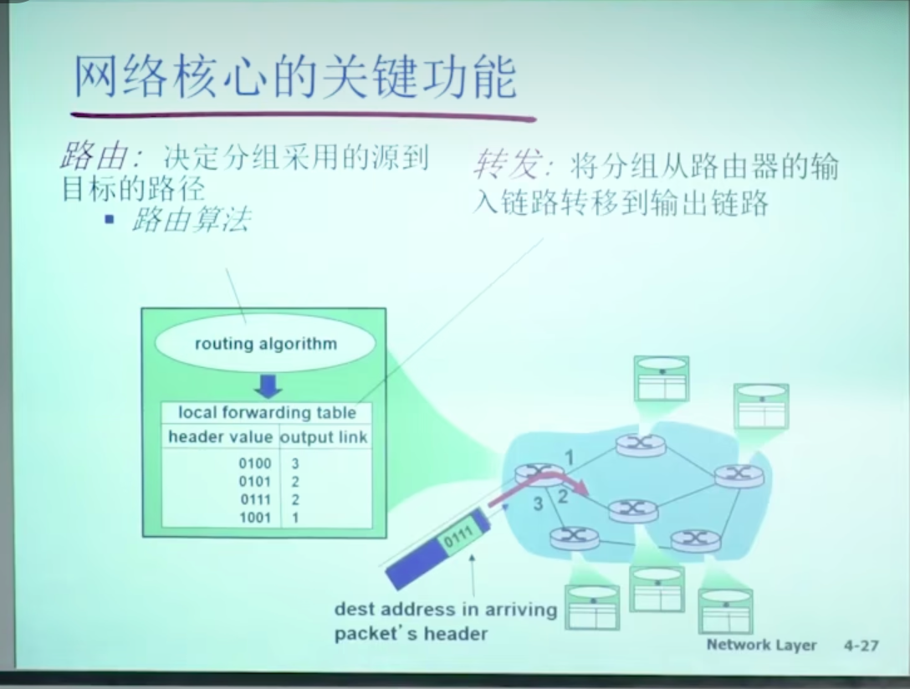

### 1.网络核心的关键功能

路由和转发

### 2.网络核心中数据交换的方式

线路交换和分组交换。

线路交换适合于电话网络的交换。

分组交换适合于互联网之间的网络交换。有共享性，所以适合于互联网。

分组交换有延迟，和丢包的现象。

丢包是因为每个路由器都有一个分组路由的队列，队列装着待转发的分组数据包，如果队列慢了，则会丢弃后面来的分组包，所以出现丢弃的现象。

延迟是因为队列如果中有分组的数据包，则后面来的数据包需要排队等待，直到前面的数据包被路由和转发走，才轮到它进行传输。

### 3.什么是MAC地址？

MAC地址（Media Access Control address）是网络通讯中在网络接口卡（NIC）中嵌入的唯一标识符。它通常被用于以太网和其他IEEE 802网络技术中。MAC地址由六个字节（或12个十六进制数字）组成，通常以如 `00:1A:2B:3C:4D:5E` 的格式显示。

#### MAC地址的用途

1. **局域网通信**： MAC地址的主要用途之一是在局域网（LAN）中辨认设备。当数据包从一个设备发送到另一个设备时，MAC地址用于确保数据包到达正确的目的地。即使在一个大型网络中，每个设备的MAC地址也是唯一的，从而确保数据的精确传输。
2. **网络访问控制**： 网络管理员可以使用MAC地址过滤来限制哪些设备可以连接到网络。例如，无线路由器通常具有功能，可以设置仅允许特定MAC地址的设备连接到网络，增加了网络的安全性。
3. **网络交换**： 在使用交换机的网络环境中，交换机使用MAC地址来决定如何将数据帧从一个端口转发到另一个端口。这是通过维护一个MAC地址表来完成的，该表记录了每个MAC地址所连接的具体端口。

#### 示例说明

假设在一个家庭网络中，你有多个设备（如手机、平板电脑、笔记本电脑）连接到一个无线路由器。每个设备都有一个唯一的MAC地址。以下是一些典型的使用情形：

1. **设置家长控制**： 一个家长可能希望限制孩子设备的网络访问。通过访问路由器的设置界面，家长可以输入孩子设备的MAC地址，并设定可上网的时间段。路由器将利用MAC地址来识别设备并执行这些规则。
2. **无线网络安全**： 为了提高家庭无线网络的安全性，可以设置一个MAC地址过滤列表，只允许列表中的设备连接网络。这样，即使有人知道了Wi-Fi密码，如果他们的设备MAC地址不在允许列表上，也无法连接到网络。
3. **网络故障诊断**： 当网络出现问题时，网络管理员或技术支持人员可以查看网络中的MAC地址表，以帮助追踪可能的问题源头。例如，如果某个设备的MAC地址与大量数据流相关联，可能表明该设备是问题的根源。

MAC地址作为网络设备的硬件地址，在网络通信中起到至关重要的角色，它确保了网络通信的正确性和安全性。