# 深入 TCP/IP 系列 TCP 可靠性原理

## [#](http://www.kangchangyi.com/article/计算机网络/深入理解TCP可靠性.html#前言)前言

随着前端技术的不断发展，越来越多的新事物、新技术出现在我们眼前，希望各位老铁在追逐新技术的同时，也能回头学习一下，那些作为程序员根基的知识。例如本系列将要讲的 `TCP/IP`。

**“深入TCP/IP系列”** 是我在阅读了一些 `TCP/IP` 相关的书籍后，对知识点进行整理产出的文章集合。

该系列文章，全文均都会尽量使用自己的理解对知识点进行说明，保证文章尽量通俗易懂。讲的明白，听的安心，奥利给！🏄‍♂️。

> tips：文中关于部分的名词解释，请在文末查看，或点击对应的锚记链接。
>
> 码字不易，如果本文对你有所帮助，就请给个赞吧👍

## [#](http://www.kangchangyi.com/article/计算机网络/深入理解TCP可靠性.html#初识-tcp)初识 TCP

> `TCP 协议` 位于 `TCP/IP 分层模型` 中的 **传输层**，是一个传输层协议。

我们通常会将 `TCP` 和同样是传输层协议的 `UDP`进行比较，但本文的目的不是比较它们两者的区别，在这里就不细说了，想知道的老铁可以戳这篇文章 👉：**[TCP 和 UDP 的区别 (opens new window)](https://juejin.im/post/6844903800336023560)**。

## [#](http://www.kangchangyi.com/article/计算机网络/深入理解TCP可靠性.html#tcp协议的特点)TCP协议的特点

- TCP 是一种 **[面向有连接通信](http://www.kangchangyi.com/article/计算机网络/深入理解TCP可靠性.html#什么是面向有连接通信)** 的协议
- 人（协议）如其名，`TCP 协议` 中文全称：`传输控制协议`；英文名：`Transmission Control Protocol`，它提供了复杂的控制机制，而控制机制的目的，就是为了保证数据传输的可靠性（这也是本文要将的重点内容）。

## [#](http://www.kangchangyi.com/article/计算机网络/深入理解TCP可靠性.html#tcp如何保证可靠性)TCP如何保证可靠性？

说到 **TCP 协议的可靠性**，可能有人第一反应想到的是 **三次握手**，**四次挥手** 这样的知识点，但除此之外，可能就不是特别清楚了。

如果你很清楚，那你或许想左滑返回 ———— 不你不想，你想复习😎。

接下来就马上讲解，`TCP` 是如何保证可靠性的，带着问题，往下阅读👇。

## [#](http://www.kangchangyi.com/article/计算机网络/深入理解TCP可靠性.html#保证可靠性の差错控制)保证可靠性の差错控制

> **TCP 差错控制** 的作用，包括检测损坏的报文段、丢失的报文段、失序的报文段，并进行纠正。

差错控制就是为了当应用程序将数据交付给 `TCP` 后，就依靠 `TCP` 将整个数据流**按序**、**没有损坏**、**没有丢失**，**没有重复**的交付给另一端的应用程序。

差错控制的方法有：**校验和**、**确认应答**、**重传** 三种。

### [#](http://www.kangchangyi.com/article/计算机网络/深入理解TCP可靠性.html#校验和)校验和

> `TCP` 可以通过 **校验和** 字段检测出数据是否损坏，每一个 **[TCP 首部](http://www.kangchangyi.com/article/计算机网络/深入理解TCP可靠性.html#TCP首部)** 都会包含 **校验和** 字段，当检测到数据损坏时，由 `接收方 TCP` 将损坏的报文段丢弃。

通俗易懂版：`TCP` 通过首部中的 **校验和** 字段，判断数据是否损坏，如果损坏，则直接丢弃。

### [#](http://www.kangchangyi.com/article/计算机网络/深入理解TCP可靠性.html#确认应答)确认应答

在 `TCP` 中，**发送端** 的数据到达 **接收端** 时，**接收端** 会返回一个“我收到消息了”的通知，这个通知就是 **确认应答（ACK）**。

> 确认应答，即 `ACK`，英文全称 `Acknowledge character`，是 `TCP` 实现可靠传输非常重要的一点

后续文中的 `ACK`，均指 **确认应答**。

举一个大家最熟悉的 **确认应答** 例子：三次握手。

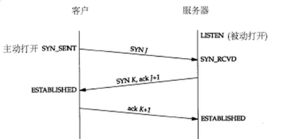

上图中，客户端发起 **请求建立连接（SYN）**，服务端收到后，同样会返回 **请求建立连接（SYN）**，以及针对 `SYN` 的确认应答 `ACK`。

确认应答（ACK）中，需要注意的点：

1. `ACK` 是不需要被确认应答的（否则就陷入了死循环，双方互相发送“我知道了”，直到网络挂掉为止🤕）。
2. 在发送数据时会尽量的捎带上 `ACK`，从而减小通信量，提高网络的利用率，这种机制被称为 **捎带应答**，就如上图中第二次握手时，发送 `SYN` 时，捎带上了 `ACK`。
3. 如果接收方收到了数据，但是没有数据要发送，也就无法做 **捎带应答**。这时候，**确认应答** 会被推迟发送，直到有新的数据到达（和这个数据一起 **确认应答**），或者经过一段时间（通常是 **500ms**），这又被称为 **延迟应答** 。

**如果发送端收到了确认应答，说明数据已经成功的到达了对端，反之，数据就很有可能丢失了，这时候就需要重传。**

### [#](http://www.kangchangyi.com/article/计算机网络/深入理解TCP可靠性.html#重传)重传

> **重传** 是差错控制的核心，当报文段损坏、丢失、或者延迟了，就需要重传。

目前 `TCP` 共实现了两种重传机制：超时重传和快重传

#### [#](http://www.kangchangyi.com/article/计算机网络/深入理解TCP可靠性.html#超时重传)超时重传

当发送端发送数据后，如果在 **特定时间间隔** 内还没有收到 `ACK`，就会进行超时重传，这里未收到确认应答有两种情况：

第一种：在发送数据的过程中，数据由于网络拥堵等原因丢失了。 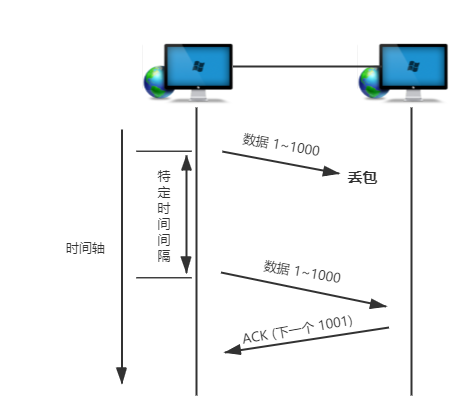

第二种：对端收到了数据，在返回 `ACK` 时，`ACK` 在途中丢失。 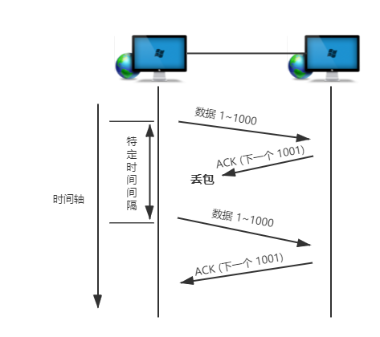

🤔这时候，好奇的同学可能就会问了，那么这个 **特定时间间隔** 是如何决定的？也就是说，**超时重传的时间** 是如何决定的？

如果超时时间定的太长，会影响重发效率和传输的性能；如果定的太短，可能 `ACK` 正在返回的路上，你的数据就先重发出去了。

最理想的情况就是找一个尽可能短的时间，但同时也能保证 `ACK` 会在这一时间内返回。

答：所以，`TCP` 做的，就是计算每次 **发送数据** 直到收到 **确认应答** 的这段时间，即 `RTT`，再和一个 **偏差值** 相加，从而计算出 **超时重传时间**。

> `RTT`，英文全称：`Round Trip Time`，它的英文名生动表明了它的意思：报文段的往返时间。

🤔可能有同学又会问了，`RTT` 我知道了，那这个 **偏差值** 是做什么的？

答：考虑到网络环境的不同，v以及随时可能发生的网络波动，**超时重传时间** 仅仅根据每次的 `RTT` 计算是不够的，还需要加上 **偏差值**，如果网络稳定性较差，那么相应的 **偏差值** 也会较大，相反的，若网络比较稳定，则 **偏差值** 也会较小。

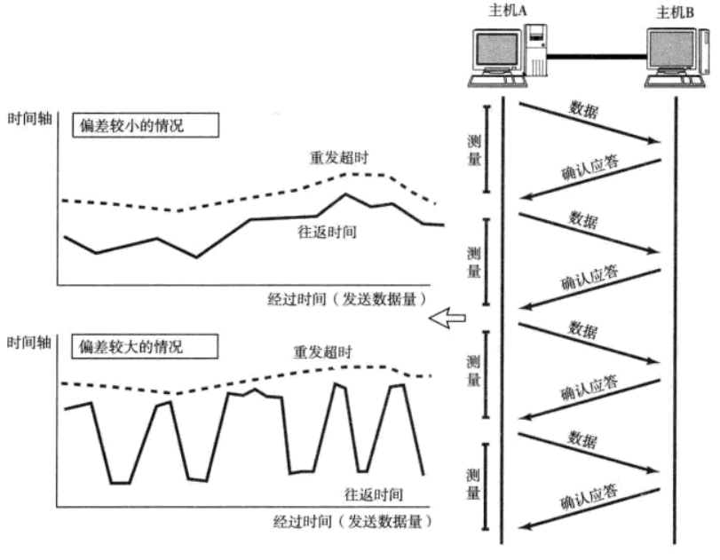

> 图片来自《图解 TCP/IP》

🤔同学们的好奇心真的很强，可能你还会注意到：**超时重传时间** 的计算需要依赖 `RTT`，但是在首次发送数据时，之前都没有 `RTT` 可以计算，那 `TCP` 是怎么确定第一次数据的 **超时重传时间** 呢？

如果你同样考虑到了这个问题，我不得不说：老铁，读文章时候的你是真的细！

答：由于最初的数据包还不知道其 `RTT`，所以其 **超时重传时间** 一般设置为 `6秒`。

> 超时时间都以 `0.5秒` 为单位进行控制，即 `0.5秒` 的整数倍，并且数据再重发后，还是如果还是收不到 `ACK`，重传时间就会以 `2^N` 倍延长，此外，如果重发达到了一定的次数还未收到 `ACK`，则发送方会强制断开连接。

#### [#](http://www.kangchangyi.com/article/计算机网络/深入理解TCP可靠性.html#快重传)快重传

> 快重传，也被称为高速重发控制，英文全称：`Fast Retransmission`

快重传基于 **[窗口控制](http://www.kangchangyi.com/article/计算机网络/深入理解TCP可靠性.html#窗口)**（后面会讲到），是指在 **发送端** 在连续三次收到同一个确认应答后，就会将其对应的数据进行重发，这种机制比超时重传更加高效。

有图更清晰： 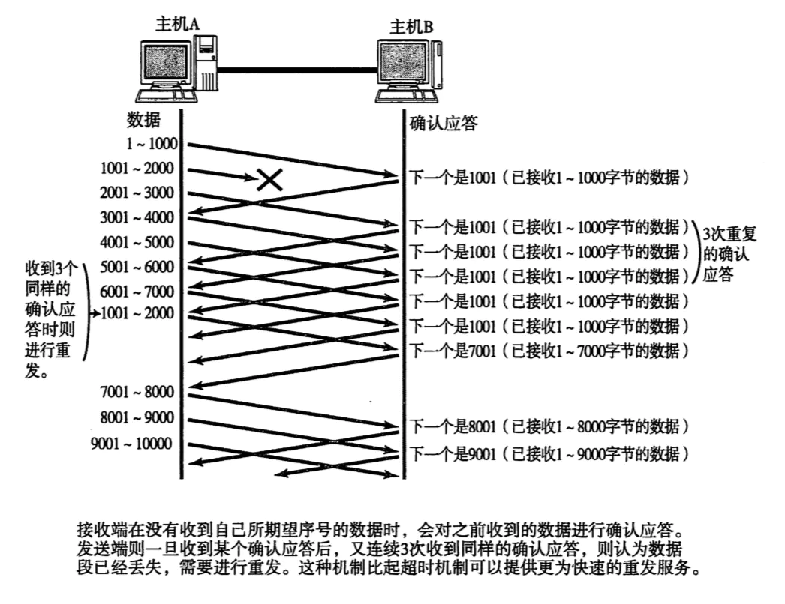

> 图片来自《图解 TCP/IP》

上图中，除了快重传，我们还可以发现，接收端成功接受 `1 ~ 1000` 的报文段后，下一个要接收的报文段序列号是 `1001`，但是 `1001 ~ 2000` 在途中丢失了，所以后续接收到的 `2001 ~ 7000` 范围的数据全都是 **失序** 的，这个时候 `TCP` 不会丢弃这些失序的报文段，而是把它们暂时存储下来，并且标记为 **失序报文段**，失序报文段不会交付给应用层，直到 `1001 ~ 2000` 到达，组成有序数据后，`TCP` 才会将数据按序的交付给 **应用层**。

## [#](http://www.kangchangyi.com/article/计算机网络/深入理解TCP可靠性.html#保证可靠性の流量控制)保证可靠性の流量控制

`TCP` 为了保证可靠性，还实现了 [端到端](http://www.kangchangyi.com/article/计算机网络/深入理解TCP可靠性.html#端到端) 的 **流量控制**，控制了发送方发送的数据量（流量），其目的是为了避免 **发送方一味的发送数据**，导致 **网络拥塞**，或者超出 **接收方的最大接收能力** 后，**接收方丢弃数据**，进一步触发重传机制，浪费网络流量而进行的控制。

> 通过流量控制，**发送端** 将不会随心所欲的发送数据，而是需要根据 **接收端的实际接受能力** 控制发送的数据量。

`TCP` 的 **流量控制** 主要通过 **窗口控制** 实现，那么什么是窗口？👇

### [#](http://www.kangchangyi.com/article/计算机网络/深入理解TCP可靠性.html#窗口)窗口

> `TCP` 以一个段为单位，每发送一个段就要进行一次确认应答（ACK）处理，这样传输的方式有一个缺点，就是包的往返时间越长，效率就越低。

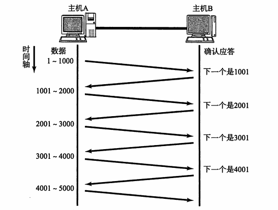

> 图片来自《图解 TCP/IP》

所以 `TCP` 引入了 **窗口** 这个概念，在窗口范围内，即使没有收到 `ACK`，也可以继续发送数据，无需一直等待 `ACK`，这个机制的实现使用了大量的缓冲区。

接收端接收到多个段后，同时对这多个段一起回复 `ACK`：

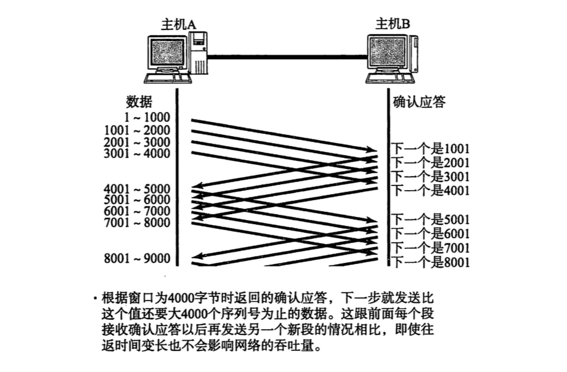

> 图片来自《图解 TCP/IP》

🤔那么问题来了，**窗口范围**，即 **窗口大小** 如何确定?

答：[TCP 首部](http://www.kangchangyi.com/article/计算机网络/深入理解TCP可靠性.html#TCP首部) 中带有 **窗口大小** 字段，在返回 `ACK` 时，就会带上这个字段，**接收端** 接收到了这个字段后，就对会自己的 **窗口大小** 进行更新（滑动）。

tips：如果返回的 **窗口大小** 为 **0**，表示 **接收端缓冲区** 已满，发送端将会停止发送数据，等待一段时间后，会发送 **窗口探测** 的包，探测目前 **窗口大小** 是否可以更新（滑动）。

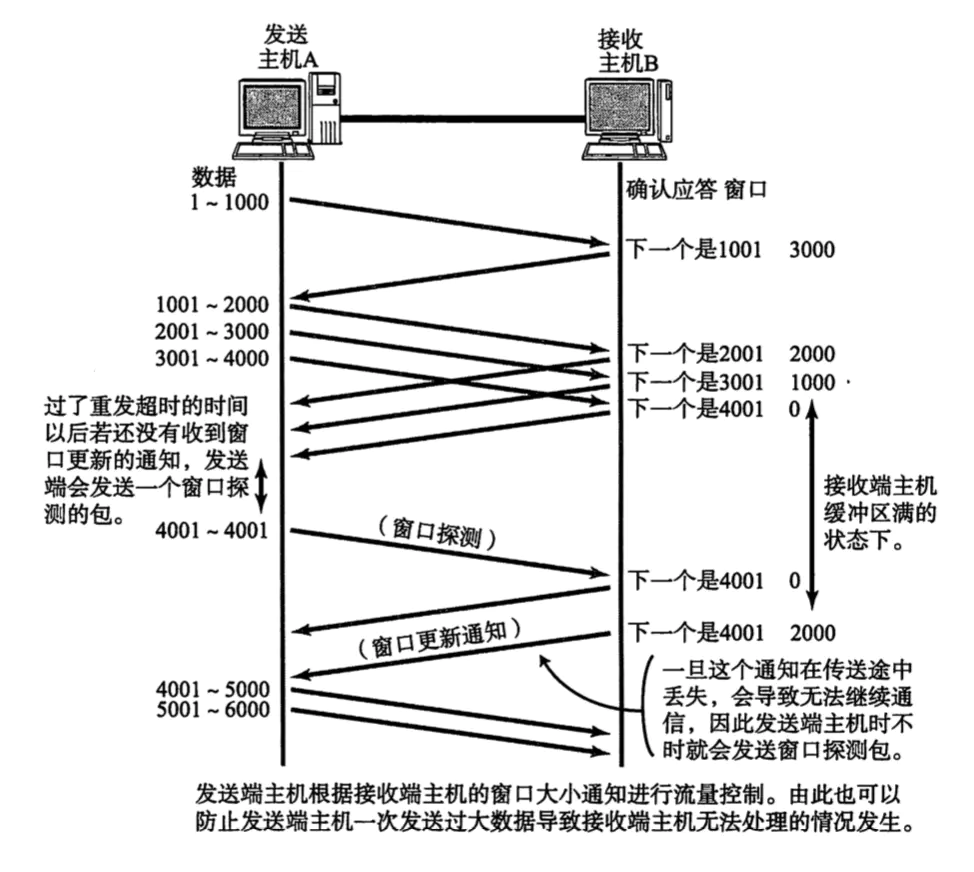

> 图片来自《图解 TCP/IP》

### [#](http://www.kangchangyi.com/article/计算机网络/深入理解TCP可靠性.html#滑动窗口)滑动窗口

在上面 **窗口** 的概念中，提到了 **“滑动”** 这个词，其实 **窗口大小的更新**，如果用更加专业一点的说法，应该叫做 **窗口滑动**。

下面马上说明， **窗口是如何滑动的**：

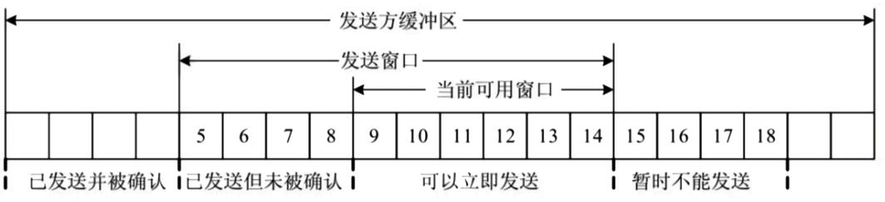

> 图片来自 知乎《TCP/IP 协议及其应用》

1. 已发送并被确认数据可以从缓冲区清除。
2. `5 ~ 8`的数据被发送之后，还未收到 `ACK`，但由于其 **窗口大小** 可以容纳 10 个 [MSS](http://www.kangchangyi.com/article/计算机网络/深入理解TCP可靠性.html#MSS)，所以可以继续发送 `9 ~ 14`的数。
3. `15 ~ 18` 是后续需要发送的数据，但由于 **流量控制**，暂时还不能发送。
4. 当收到了 `5 ~ 8` 的 `ACK`，**发送窗口** 整体向右滑动，使新的数据进入到窗口中，新的数据可以发送。
5. 窗口按照以上规律不断向前滑动，因此这种机制被称为：**滑动窗口机制**

👋 讲到这里，大家对 **窗口控制** 已经有了一定的了解，其实除了 **发送窗口**，**接收端** 也拥有自己的 **“接收窗口”**，只有在 **接收窗口** 滑动时（同时发出 `ACK`），**发送窗口** 才有可能滑动，并且 **发送窗口** 始终小于 **接收窗口**。

此外，**滑动窗口的操作中可能会出现一个严重的问题：糊涂窗口综合征**

这里不做重点，有兴趣的同学戳👉 [糊涂窗口综合征](http://www.kangchangyi.com/article/计算机网络/深入理解TCP可靠性.html#糊涂窗口综合征)，或 `Google` 搜索。

## [#](http://www.kangchangyi.com/article/计算机网络/深入理解TCP可靠性.html#保证可靠性の拥塞控制)保证可靠性の拥塞控制

我们已经知道，**流量控制** 可以对收发两端进行控制，保证可靠性。

但别忘了，还有重要的一点，应用程序的数据都在网络上传输，如果网络发生拥塞，如何继续保证可靠性？

> **拥塞** 是由于网络中的路由器由于 **超载** 而引起的严重延迟现象，拥塞的发生会造成数据丢失，进而引发 **超时重传**，而超时重传又会进一步加剧拥塞，如果不进行控制，最终会导致整个网络的瘫痪。

为了避免和消除网络拥塞，RFC 2581 为 `TCP` 定义了 **四种拥塞控制机制** 🚣‍♀️：

1. 慢启动
2. 拥塞避免
3. 快重传
4. 快恢复

### [#](http://www.kangchangyi.com/article/计算机网络/深入理解TCP可靠性.html#拥塞窗口)拥塞窗口

在讲 **拥塞控制策略** 之前，需要先了解一个之前没有提到过的窗口：**拥塞窗口**。

why？因为 **拥塞控制策略** 核心就是如何控制 **拥塞窗口**。

**拥塞控制** 主要通过利用 **发送窗口** 限制数据流的速度，减缓注入网络的数据流量后，拥塞自然就会解除。

而起关键作用的 **发送窗口** 的大小，取决于两个因素，一个是 **接收窗口** 的大小，另一个就是 **拥塞窗口**。

**发送窗口** 的最终大小取决于两者中较小的那一个，和 **接收窗口** 一样，**拥塞窗口** 也会在控制中不断调整，一旦发现拥塞，`TCP` 就会减小 **拥塞窗口**，进而控制 **发送窗口**。

### [#](http://www.kangchangyi.com/article/计算机网络/深入理解TCP可靠性.html#拥塞控制策略)拥塞控制策略

> `TCP` 处理拥塞有三个策略，**慢启动**、**拥塞避免**、**拥塞检测**，`TCP` 循环往复地采用三个策略来控制 **拥塞窗口** 大小。

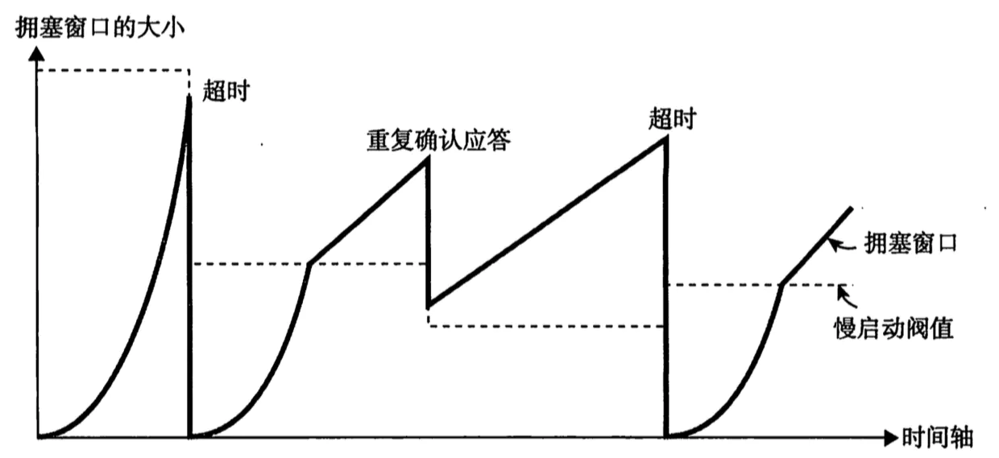

> 图片来自 《图解 TCP/IP》
>
> 先放图张，再讲策略

#### [#](http://www.kangchangyi.com/article/计算机网络/深入理解TCP可靠性.html#慢启动)慢启动

`TCP` 首先使用 **慢启动** 阶段，在建立连接时，将 **拥塞窗口** 设置为一个 1 个 [MSS](http://www.kangchangyi.com/article/计算机网络/深入理解TCP可靠性.html#MSS) 大小发送数据，但随着收到每个报文段的 `ACK`，**拥塞窗口** 大小将按照 **指数规律增长**，例如 1 个、2 个、4个、8 个 MSS...。（如上图)

虽然呈指数规律增长，但不会无止境的继续下去，当窗口的大小到达 **慢启动阀值** 时（一般为 65535 字节），就会进入下一个阶段： **拥塞避免** 👇。

#### [#](http://www.kangchangyi.com/article/计算机网络/深入理解TCP可靠性.html#拥塞避免)拥塞避免

拥塞避免阶段， **拥塞窗口** 大小将按照加法： **线性规律增长**。

增加值的公式为：`(1 个数据段的字节数 / 拥塞窗口大小（字节）) * 1 个数据段字节数`。

公式比较麻烦，我们只要记住，在这个阶段，**拥塞窗口** 若要增加，最大也只增加 1 个 MSS 大小。（如上图）

在此阶段，减缓了 **拥塞窗口** 的增长，但仍在增加，直到 **拥塞被检测** 到 👇。

#### [#](http://www.kangchangyi.com/article/计算机网络/深入理解TCP可靠性.html#拥塞检测)拥塞检测

`TCP` 通过两个条件来判断是否发生拥塞：

1. 是否 **超时**
2. 是否 **连续收到三个相同的 `ACK`**

当拥塞发生时，**拥塞窗口** 大小必须减少，否则会加剧拥塞，同时 **拥塞窗口** 大小减少的程度，也会根据触发的条件不同而不同，有两种情况：

1. 发生 **超时** 时

如果发生超时，那么拥塞的可能性很大，遇到这种情况 `TCP` 的反应也比较强烈，直接将 **慢启动阀值** 设为当前窗口的一半（见上图），并且将当前 **拥塞窗口** 重新设置为 1 个 MSS，然后重新进入慢启动阶段。

1. 连续收到三个相同的 `ACK`

如果连续收到了三个相同的 `ACK`，那么拥塞的可能性比较小，之前传输的一个报文段可能在途中丢失了，但之后的几个又正常的到达了，这个时候，`TCP` 会触发 [快重传](http://www.kangchangyi.com/article/计算机网络/深入理解TCP可靠性.html#快重传)（就是之前说的），和 **快恢复**。

- 快恢复

当触发 **快恢复** 时，`TCP` 会将 **慢启动阀值** 设为当前窗口的一半，**拥塞窗口** 设置为当前的阀值（某些实现里可能不一样）。

## [#](http://www.kangchangyi.com/article/计算机网络/深入理解TCP可靠性.html#相关知识点简述🧐)相关知识点简述🧐

> [回到顶部](http://www.kangchangyi.com/article/计算机网络/深入理解TCP可靠性.html#前言)
>
> [回到中间](http://www.kangchangyi.com/article/计算机网络/深入理解TCP可靠性.html#保证可靠性の流量控制)

### [#](http://www.kangchangyi.com/article/计算机网络/深入理解TCP可靠性.html#什么是面向有连接通信)什么是面向有连接通信

如果将协议按照 **传输方式** 分类，可以分为 **面向有连接型** 和 **面向无连接型**。

**面向有连接型** 的协议在发送数据之前，会在收发主机之间建立一条 **通信线路**，举个例子就好比打电话，需要对方也接听之后，才能进行通话，也就是说，在面向有连接型中，必须与对方建立连接才能进行通信，否则无法进行通信。

### [#](http://www.kangchangyi.com/article/计算机网络/深入理解TCP可靠性.html#tcp首部)TCP首部

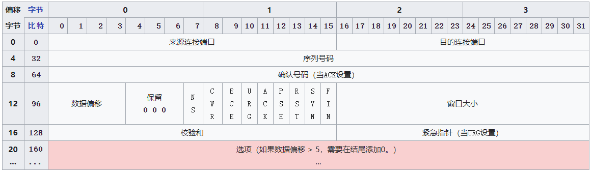

> 图片来自维基百科

### [#](http://www.kangchangyi.com/article/计算机网络/深入理解TCP可靠性.html#端到端)端到端

所谓 **端到端**，就是指 **发送端** 和 **接收端**，不包括网络中间设备（例如：路由器等）。

因此当网络中间设备发生拥塞时，**流量控制** 将不起作用，因为它仅作用于 —— **两端**。

### [#](http://www.kangchangyi.com/article/计算机网络/深入理解TCP可靠性.html#mss)MSS

**MSS**，英文全称：`Maximum Segment Size`，即 **最大消息长度**，在 `TCP` 传递大量数据时，数据将以 MSS 大小分割发送。

`TCP` 中的 **MSS** 是在三次握手时，在两端主机之前计算得出，两端主机在发起 `SYN`（建立连接请求） 时，会在首部中写入自己能够适应的 **MSS** 大小，然后在两者中选择较小的一个投入使用。

### [#](http://www.kangchangyi.com/article/计算机网络/深入理解TCP可靠性.html#糊涂窗口综合征)糊涂窗口综合征

> 糊涂窗口综合征，指的是发送数据方应用程序产生数据很慢，或者接收方应用程序消耗数据很慢，降低了传输效率。

当发送方应用程序产生数据很慢，就会使得发送的数据报文很小，甚至是一个字节一个字节的发送。

解决的方法就是强迫发送方 `TCP` 等待，等凑成了足够长度的报文段，再进行发送，重复此步骤，即：`Nagle 算法`

## [#](http://www.kangchangyi.com/article/计算机网络/深入理解TCP可靠性.html#总结)总结

至此，TCP 的可靠性就全部讲完了，如果你还没有完全消化，没有关系，纯理论的知识需要慢慢吸收，只要坚持学，肯定能弄懂🎯。

以前听过一句话：

> 最好的答案不一定是你想出来的，你可以在其他人那里找。

所以，如果你发现文中有什么内容和你目前所理解的有出入，欢迎讨论。

最后，回顾一下本文讲了哪些内容：

- [TCP 协议的特点](http://www.kangchangyi.com/article/计算机网络/深入理解TCP可靠性.html#TCP协议的特点)
- [TCP 如何保证可靠性](http://www.kangchangyi.com/article/计算机网络/深入理解TCP可靠性.html#TCP如何保证可靠性？)
- [1. 差错控制](http://www.kangchangyi.com/article/计算机网络/深入理解TCP可靠性.html#保证可靠性の差错控制)
- - [校验和](http://www.kangchangyi.com/article/计算机网络/深入理解TCP可靠性.html#校验和)
- - [确认应答](http://www.kangchangyi.com/article/计算机网络/深入理解TCP可靠性.html#确认应答)
- - [重传](http://www.kangchangyi.com/article/计算机网络/深入理解TCP可靠性.html#重传)
- [2. 流量控制](http://www.kangchangyi.com/article/计算机网络/深入理解TCP可靠性.html#保证可靠性の流量控制)
- - [滑动窗口](http://www.kangchangyi.com/article/计算机网络/深入理解TCP可靠性.html#滑动窗口)
- [3. 拥塞控制](http://www.kangchangyi.com/article/计算机网络/深入理解TCP可靠性.html#保证可靠性の拥塞控制)
- - [慢启动](http://www.kangchangyi.com/article/计算机网络/深入理解TCP可靠性.html#慢启动)
- - [拥塞避免](http://www.kangchangyi.com/article/计算机网络/深入理解TCP可靠性.html#拥塞避免)
- - [拥塞检测](http://www.kangchangyi.com/article/计算机网络/深入理解TCP可靠性.html#拥塞检测)