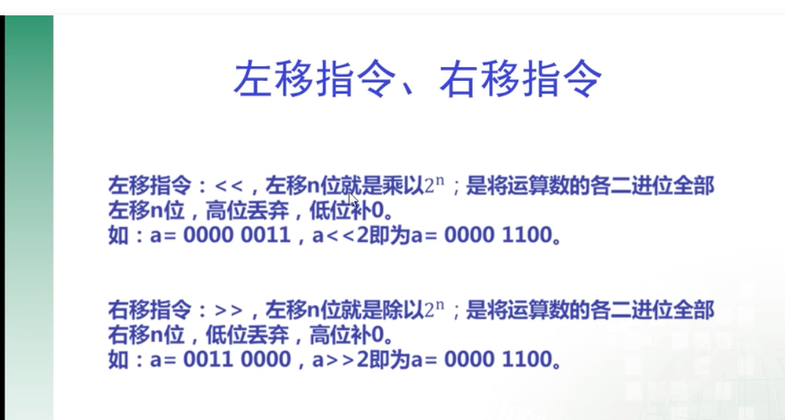

### 1.unicode和utf-8的区别和联系

unicode是一种通用的字符集，utf-8是unicode字符集的一种编码方式。

比如汉字"严"在unicode字符集中对应的字符编码是20005（也称为码位，其4e25（16进制）），虽然说，可以把他转换成二进制直接存入硬盘中，但如果遇到英文字母，比如t，它的字符编码是0074（16进制）,转换成二进制时会变成（0000 0000 0111 0100），前面8位都是0，前面的8位就很浪费内存（浪费了一个字节，一个字节等于8位嘛）。所以不能直接存。需要utf-8的方式去存，utf-8是一种可变长的编码方式。英文字母的，换用一个字节去存，汉字的话会用3个字节去存。这样就能提高存储的效率。


unicode转成utf-8时，有一套特定的规则


gbk和ascii都是字符集。


### 2.位运算

#### 2.1异或运算，可以不借助临时变量交换两个变量的值

什么是异或运算。两个位相同为0，相异为1

比如

```
int a = 10
int b = 9

		10 => 1010
		9  => 1001
异或(^)后-------------
					0011 => 3
					
					所以 10 ^ 9 = 3
```

异或运算有两个性质

1.遵循交换律和结合律

交互律，a^b和b^a是一样的。结合律：a^b^c 和a^（b^c ）是一样的。

2.0和N(N是任意一个数)异或等于N，N和N异或等于0。  0^N=N , N^N=0 

3.一堆数进行异或时，和顺序无关。比如a^b^c^d^e = a^((b^c)^(d^e))


```
int a = 10
int b = 12 //即使b等于10也能异或，只要保存两个变量部是指向同一块内存即可。

a = a^b  
b = a^b//a^b^b => a^0 => a   b =a //0^b 
a = a^b // a^b^a => a^a^b=>0^b=>b  a=b  //
这样就不需要额外变量，交换了a和b的值。
此方法只能比较两个内存地址不一样的数据，比如在数组中，如果需要交换两个数组元素。比如，想要交换数组arr[i]和arr[j]的值，
一定要保证i和j不能相等，相等的话，就会变成同样一块内存地址的数据，进行自己和自己异或，会变成0.

```


#### 2.2位运算，取反（一般的取反符号是～，而go里面是^）

**1.不会二进制和十进制转换的同学点击这里学习**[https://jingyan.baidu.com/article/597a0643614568312b5243c0.html](https://link.zhihu.com/?target=https%3A//jingyan.baidu.com/article/597a0643614568312b5243c0.html)


**2.二进制中第一位为符号位，0代表正数，1代表负数，如 \*0\*000 0001 是+1，\*1\*000 0001 是-1。**

**3.系统运算补码取反时符号位不变，我们手动用运算符取反时符号位改变，这也就是为什么正数取反得负数，负数取反得正数。**

**4.二进制中，+0与-0，不完全一样，感兴趣的同学自行搜索学习。**


￥￥￥￥￥￥￥￥￥￥￥￥不要看我，我是一条没有感情的分割线￥￥￥￥￥￥￥￥￥￥￥￥


首先确定一件事情，取反就是将数字转化为二进制，再把二进制中的1变成0，0变成1。


那么具体怎样解释例如~10=-11呢？


这就要从二进制的存储方式讲起。**计算机并不直接存储二进制原码**，**而是存储二进制的补码**。**正数的补码就是原码**，比如1，原码0000 0001，补码也为0000 0001。而**负数的补码，是“符号位不变，原码取反再加一”**（计算机毕竟不是人，需要人为嵌入一套完美的规则。这种存储方式有着严谨的数学证明，感兴趣的同学可以自行上网查找。），比如-1，原码1000 0001，取反1111 1110，加一后1111 1111，1111 1111就是-1的二进制补码。**负数输出时，将补码逆向译成原码，原码取反加一得补码，补码减一取反得原码**。


\~~~~~~~~~~~~~~不要看我，我还是一条没有感情的分割线~~~~~~~~~~~~~~~~~


接下来，进入正题。


十进制，数字10

二进制原码即补码 0000 1010 直接存储

~10后原码（补码）变为 1111 0101

由于他的符号位是1，系统认为这是一个负数的补码

负数输出时，先将补码减一得1111 0100，再取反得1000 1011

换算成十进制就是-11了


是不是觉得还差点意思？那就再来一个负数的例子


十进制，数字-5

二进制原码 1000 0101

取补码（还记得负数补码吗？符号位不变，原码取反再加一） 1111 1011

~（-5），即取反后得 0000 0100

由于他的符号位是0，系统认为这是一个正数的补码

正数补码即原码，最终输出0000 0100

换算成十进制就是4了


************我跟上面两条分割线不一样，我是有感情的 ，现在我要放大招了***************


**取反运算简便方法**

**也可以说是适合人类运算的计算方法：**

**如对 a 按位取反，则得到的结果为 -(a+1) .**

**此条运算方式对正数负数和零都适用。**


#### 3.左移和右移运算

