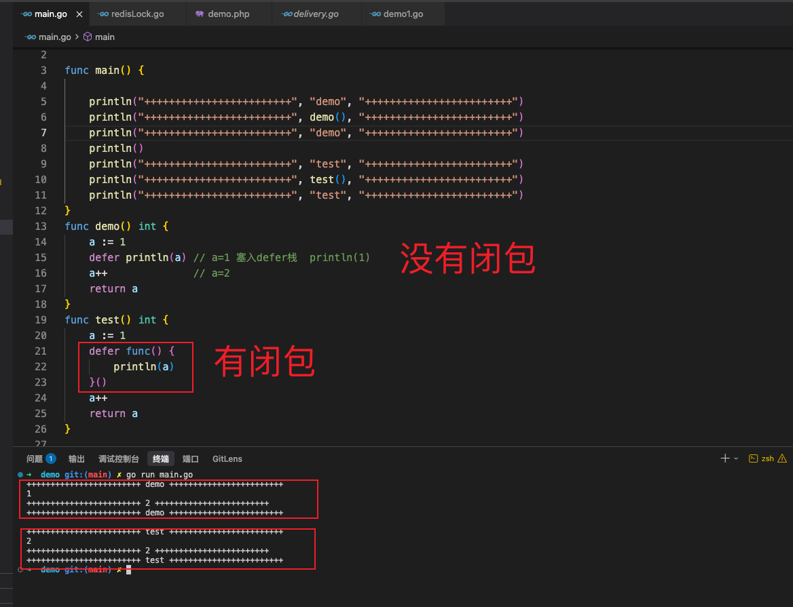
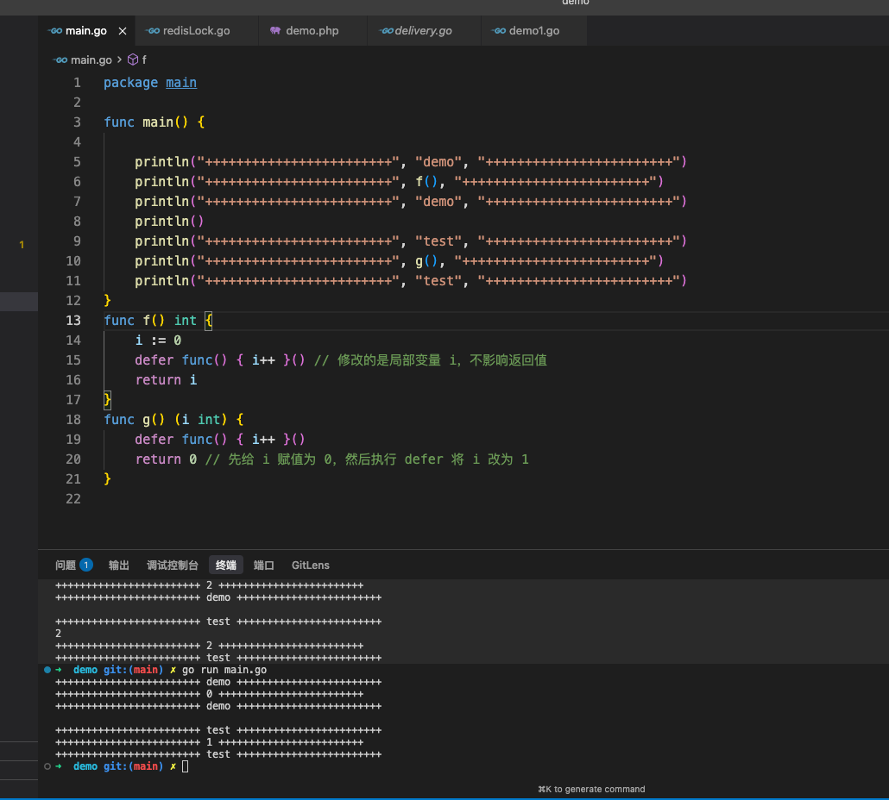

## 1.goroutine 面试题

1.1 如果结束goroutine的执行

1.1.1 使用context的ctx通信和go goroutine通信

```go
package main

import (
	"context"
	"fmt"
	"time"
)

// 测试代码
func main() {

	ctx, cancel := context.WithCancel(context.Background())

	go func() {
		for {
			select {
			case <-ctx.Done():
				println("work 结束")
			default:
				fmt.Println("is working")
				time.Sleep(1 * time.Second)
			}
		}
	}()
	time.Sleep(3 * time.Second)
	cancel()
	fmt.Println("main is over")

}

// 也可以使用超时控制
ctx, cancel := context.WithTimeout(context.Background(), 5*time.Second)
defer cancel() // 确保资源释放
go worker(ctx)
```


使用chan 通信

```go
package main

import (
	"context"
	"fmt"
	"time"
)

// 测试代码
func main() {

	chanOne := make(chan struct{})

	go func() {
		for {
			select {
			case <- chanOne:
				println("work 结束")
			default:
				fmt.Println("is working")
				time.Sleep(1 * time.Second)
			}
		}
	}()
	time.Sleep(3 * time.Second)
	chanOne <- struct{}{}
	fmt.Println("main is over")

}

```


## 2. 如何实现并发安全的计数器？

**解答**：

- 方法一：使用互斥锁（`sync.Mutex`）。
- 方法二：使用原子操作（`sync/atomic.AddInt64`），性能更高。

```go
package main

import (
	"fmt"
	"sync"
	"sync/atomic"
)

// 测试代码
func main() {

	var initNum int64
	c := &Count{&initNum}

	w := sync.WaitGroup{}
	i := 0
	fmt.Println(c.getValue())
	for {
		if i >= 1000 {
			break
		}
		go func() {
			defer w.Done()
			w.Add(1)
			c.add(1)
			fmt.Println(c.getValue())
		}()
		//
		i++
	}
	w.Wait()
	println(c.getValue())
	fmt.Println("main is over")
}

type Count struct {
	value *int64
}

func (c *Count) add(num int64) {
	atomic.AddInt64(c.value, num)
}

func (c *Count) getValue() int64 {
	return atomic.LoadInt64(c.value)
}

```


## 3.Go 的值类型和引用类型分别有哪些？slice/map/channel 本质属于哪一类？

go里面其实所有的变量传递都是值传递，有些数据类型看起来是引用传递是因为传递的值是底层数据结构的指针，比如切片，map，channel，function 这些都是引用类型。int float string bool 结构体， 数组这些是值类型。


## 4.slice 的扩容机制是怎样的？什么时候 2 倍，什么时候 1.25 倍？

新版的go 在在容量为长度为256以下会扩容一倍，以上一般会扩容1.25倍，特殊情况会根据新增的元素直接扩容到需要的容量。

## 5.defer 原理是什么？执行顺序是什么？  defer 修改返回值的原理是什么？


defer 即使panic 也会defer 

```
func main() {
  fmt.Println("start")

  defer fmt.Println("deferred")  

  panic("crash")
}

start
deferred
panic: crash
```


## 1. defer 的本质

`defer` 语句会将一个函数调用“推迟”到外层函数返回之前执行。它的底层实现依赖于每个 goroutine 内部维护的一个 **defer 链表**（`_defer` 结构体）。每当执行到 `defer` 时，Go 运行时会在当前 goroutine 的链表头部插入一个新的 `_defer` 结构体，其中记录了被推迟的函数、参数等信息。

**关键特性：**

- **后进先出（LIFO）**：后定义的 `defer` 会先执行（类似栈）。

- **参数预计算**：`defer` 语句执行时，其后面的函数参数会立即被求值并保存，而不是等到调用时才求值。（如果有闭包函数(没有传参数或者创新变量)会把复制一份变量的指针，然后传入变量的指针。否则，会复制一份变量值，到链表中）

- ```go
  func test() int {
  	a := 1
  	defer func() {
  		println(a)  //有闭包，传入a的指针进去 *a 塞入defer栈  println(a)
  	}()
  	a++  // a = 2
  	return a
  }
  
  
  func test() int {
  	a := 1
  	defer println(a) // 没有闭包 a = 1
  	a++  // a = 2
  	return a
  }
  
  
  ```

  

- **与 return 的关系**：`defer` 在 `return` 之后、函数真正返回之前执行。如果函数有命名返回值，`defer` 可以修改返回值。
  return 解构

  一条简单的return 语句也是有执行顺序的，一共有三步 
  1 执行返回变量的赋值
  2 执行defer 栈中的函数
  3 返回变量 函数结束

  

  比如

  ```go
  func demo() (int) { // 返回值有命名 返回值是a
    a := 1
    defer println(a)  // 没有闭包，传入a的值进去 a=1 塞入defer栈  println(1)
    a++  // a=2
    return a
  }
  
  //第一步 给返回变量赋值，有定义变量名时 a = 2
  //第二步 执行defer栈中的函数 println(1)
  //第三步 返回变量值 a ，a=2 
  //结果 输出defer 中的1 ，再输出2
  
  
  func test() int {
  	a := 1
  	defer func() {
  		println(a)  //有闭包，传入a的指针进去 *a 塞入defer栈  println(a)
  	}()
  	a++  // a = 2
  	return a
  }
  
  //第一步 给返回变量赋值，有定义变量名时 a = 2
  //第二步 执行defer栈中的函数 println(a) a= 2
  //第三步 返回变量值 a ，a=2 
  // 结果 输出defer 中的2 ，再输出2
  ```

  

-----------------------------------


### 命名返回值 vs 匿名返回值

**匿名返回值**：函数声明没有给返回值起名字，如 `func f() int`。此时 `return` 会先创建一个临时变量保存返回值，然后执行 defer，最后返回这个临时变量。defer 无法修改匿名返回值。


```go
package main

func main() {

	println("++++++++++++++++++++++++", "demo", "++++++++++++++++++++++++")
	println("++++++++++++++++++++++++", f(), "++++++++++++++++++++++++")
	println("++++++++++++++++++++++++", "demo", "++++++++++++++++++++++++")
	println()
	println("++++++++++++++++++++++++", "test", "++++++++++++++++++++++++")
	println("++++++++++++++++++++++++", g(), "++++++++++++++++++++++++")
	println("++++++++++++++++++++++++", "test", "++++++++++++++++++++++++")
}
func f() int {
    i := 0
    defer func() { i++ }() // 修改的是局部变量 i，不影响返回值
    return i
}
func g() (i int) {
    defer func() { i++ }()
    return 0 // 先给 i 赋值为 0，然后执行 defer 将 i 改为 1
}

```




补充点


```
为什么会有这种差异？
Go 1.22 之前的语义（经典陷阱）
go
for i := 0; i < 3; i++ {
    defer func() { fmt.Println(i) }()
}
在 Go 1.22 之前，循环变量 i 在整个循环过程中只有一个实例，其地址不变。每次迭代中，defer 闭包捕获的是同一个变量 i 的引用。当循环结束后，i 的值变为 3，然后 defer 开始执行（LIFO 顺序），三个闭包都读取到 i=3，因此打印三次 3。

Go 1.22 及之后的语义（修正行为）
从 Go 1.22 开始，语言规范做了调整：每次迭代都会创建一个新的循环变量副本。也就是说，每次迭代的 i 在内存中是独立的变量。因此：

第一次迭代：i 的副本值为 0，defer 闭包捕获的是这个副本的地址。

第二次迭代：新的 i 副本值为 1，defer 闭包捕获新副本。

第三次迭代：新的 i 副本值为 2，defer 闭包捕获这个副本。
循环结束后，三个 defer 按照 LIFO 执行：先打印捕获到的值 2，然后 1，最后 0。

这就是为什么你现在运行（使用 Go 1.22+）会得到 2,1,0，而不是经典的 3,3,3。

如何验证？
你可以用以下命令检查自己的 Go 版本：

bash
go version
如果输出类似 go version go1.22.0 或更高，那么你看到的结果就是 2,1,0。

对之前回答的补充
我在之前的回答中给出的例子是基于 Go 1.22 之前的经典行为。为了准确，现在补充说明：

Go 1.22 之前：输出 3,3,3（经典陷阱）。

Go 1.22 及之后：输出 2,1,0（每次迭代独立变量）。

无论版本如何，defer 的底层原理不变（LIFO、参数立即求值、闭包捕获变量地址），只是循环变量的语义得到了改进，使得这种代码的行为更符合直觉。
```


## 6.new 和 make 的区别？分别用于哪些场景？


## 7.interface 的底层结构是什么？（itab + data）如何实现动态分派？


# 二、Go语言进阶（5题）

# GMP 调度模型详细讲一下（G、M、P 分别是什么？）

## GMP 调度模型详解

GMP 是 Go 运行时实现的高性能用户态调度模型，旨在将大量 goroutine 高效地复用在少量操作系统线程上。**G、M、P** 是三个核心组件。

------

### 一、三个核心实体

| 组件  | 全称      | 本质                             | 数量关系                                     |
| :---- | :-------- | :------------------------------- | :------------------------------------------- |
| **G** | Goroutine | 用户态的“任务”                   | 运行时存在大量 G（成千上万）                 |
| **M** | Machine   | 操作系统线程                     | 通常与 CPU 核心数相当（例如 8 核，则 M ≈ 8） |
| **P** | Processor | 调度上下文（本地队列、调度资源） | 通常等于 `GOMAXPROCS`（默认为 CPU 核数）     |

#### 1. G（Goroutine）

- 存储了 goroutine 的执行栈、程序计数器、寄存器、状态等信息。
- 结构体 `runtime.g` 包含字段：`stack`（栈边界）、`pc`（程序计数器）、`atomicstatus`（状态：`_Grunnable`、`_Grunning`、`_Gwaiting` 等）、`sched`（保存暂停时的 PC/SP 等）。
- 极轻量：初始栈仅 2KB，动态扩缩。

#### 2. M（Machine）

- 对应一个真实的操作系统线程（由 pthread 或 Windows CreateThread 创建）。
- 必须绑定一个 P 才能执行 G（即 M 执行 G 前需要先获取 P）。
- 结构体 `runtime.m` 包含：`g0`（特殊 goroutine，用于执行调度代码）、`curg`（当前正在执行的 G）、`p`（当前绑定的 P）、`nextp`（用于暂存 P）等。
- M 的创建与回收由运行时按需控制，不会无限增长。

#### 3. P（Processor）

- 逻辑处理器，不是 CPU 核心，而是调度上下文资源。
- 主要职责：
  - 维护一个**本地 G 队列**（Local Run Queue, LRQ，无锁队列，容量 256）。
  - 存储一些调度状态（例如下一个要执行的 G）。
  - 负责从全局队列或其它 P 那里“偷取”G。
- 结构体 `runtime.p` 包含：`runq`（本地 G 队列数组）、`runqhead/runqtail`（队列头尾指针）、`runnext`（下一个要执行的 G，优先级高）、`gFree`（空闲 G 缓存）等。

------

### 二、GMP 的运行机制

#### 1. 正常调度流程

1. **创建 G**：`go func()` → 新建一个 G，放入当前 P 的本地队列（如果本地队列满了，则放入全局队列）。
2. **调度循环**：M 通过其绑定的 P 从本地队列获取一个 G 并执行（`execute` → `gogo` 汇编切换栈和寄存器）。
3. **协作点**：当 G 执行一段时间（或发生阻塞、系统调用、主动调用 `runtime.Gosched()`）时，调度器介入：
   - 将当前 G 的状态改为 `_Grunnable` 并放回队列（或挂起状态）。
   - 从 P 的本地队列取出下一个 G 执行（`schedule()` 函数）。
4. **抢占**：Go 1.14 之后实现了基于信号的异步抢占，防止长循环 G 霸占 CPU。

#### 2. 阻塞处理 —— 让出 P

| 阻塞类型                               | 处理方式                                                     |
| :------------------------------------- | :----------------------------------------------------------- |
| **channel 阻塞、time.Sleep、网络 I/O** | G 进入 `_Gwaiting` 状态，M 与 P 解绑，P 寻找空闲 M 继续执行其他 G；当 G 就绪后，重新进入可运行队列。 |
| **系统调用阻塞（如文件 I/O）**         | G 进入 `_Gsyscall` 状态，M 阻塞，但 P 会与 M 解绑并尝试绑定新的 M（或从空闲池获取 M），继续调度其他 G。系统调用返回后，M 会尝试重新获取原来的 P，若失败则将 G 放入全局队列。 |
| **网络 I/O 多路复用**                  | 利用 netpoller（epoll/kqueue/IOCP），G 阻塞时注册到 epoll，M 不阻塞；事件就绪后 netpoller 将 G 放回运行队列。 |

#### 3. 工作窃取（Work Stealing）

为了保证负载均衡，当某个 P 的本地队列为空时，它会：

- 从全局队列中获取一批 G（每批最多 128 个）。
- 如果全局队列也为空，则尝试从其他 P 的本地队列**偷取一半**的 G（窃取算法随机轮询，避免锁竞争）。
- 如果依然没有 G 可运行，M 会与 P 解绑并进入空闲 M 池（休眠），直到有新任务。

工作窃取极大地减少了 M 的空闲和上下文切换，充分利用多核。

------

### 三、调度器数据结构关系图

text

```
全局队列（runq）  —— 无锁队列，存放可运行的 G
     │
     ▼
  ┌────────────────────────────────────┐
  │              P (本地队列)           │
  │  ┌────┬────┬────┬────┬────┐       │
  │  │ G1 │ G2 │ G3 │ ... │     │       │
  │  └────┴────┴────┴────┴────┘       │
  │  runnext (优先级最高的一个 G)       │
  └──────────────┬─────────────────────┘
                 │ 绑定
                 ▼
        ┌────────────────┐
        │       M        │
        │  (OS 线程)      │
        │  ├─ curg       │
        │  └─ g0 (调度栈)│
        └────────────────┘
                 │
                 ▼
           执行 G 的用户代码
```


------

### 四、关键调度细节

#### 1. `runnext` 优化

- 每个 P 有一个 `runnext` 字段，存放**下一个最高优先级的 G**（通常是通过 `go func()` 新创建的 G，或刚唤醒的 G）。
- 调度器会优先执行 `runnext`，然后才从本地队列头部取 G。这减少了 goroutine 切换延迟，提升局部性。

#### 2. 自旋线程（Spinning M）

- 当没有可运行的 G 时，M 不会立即阻塞，而是短暂地自旋（spin）几次，尝试从其他 P 偷取 G。
- 自旋状态分两种：
  - **空闲自旋**：M 没有绑定 P，但正在寻找可用的 P 和 G。
  - **工作自旋**：M 绑定了 P，但 P 的本地队列为空，正在偷取 G。
- 自旋期间会检查全局队列、netpoller 等。如果长时间无任务，M 才会休眠（进入阻塞状态）。

#### 3. sysmon 监控线程

Go 运行时有一个特殊的 M（不绑定 P）执行 `sysmon` 函数，用于：

- 检测长时间运行的 G（超过 10ms）并发出抢占信号。
- 检测网络轮询器是否就绪。
- 强制垃圾回收。
- 将空闲时间过长的 P 从 M 上剥离，回收 M。

------

### 五、GMP 调度器的优势

| 传统线程调度（1:1）                     | GMP（N:M）                             |
| :-------------------------------------- | :------------------------------------- |
| 线程阻塞 → 内核切换 → 成本高            | G 阻塞 → P 立即转移 → 成本极低         |
| 大量线程导致内存爆炸（每个线程 8MB 栈） | 大量 G 共享少量 M（2KB 栈起步）        |
| 全局竞争锁（C10K 问题）                 | 无锁队列 + 工作窃取，近乎线性扩展      |
| 无法利用多核亲和性                      | P 绑定到 CPU 核心（通过 `GOMAXPROCS`） |

------

### 六、常见面试题

**Q：P 的数量可以动态调整吗？**
A：可以，通过 `runtime.GOMAXPROCS(n)` 在运行时修改，但一般建议与 CPU 核数相同。修改后会尝试增加或减少 P，多余 P 上的 G 会被迁移到其他 P 或全局队列。

**Q：M 的最大数量是多少？**
A：默认 10000，由 `runtime/debug.SetMaxThreads` 限制。当系统调用阻塞的 M 过多时，会创建新的 M，但通常不会超过 10000。

**Q：G 的调度时机有哪些？**
A：1. `go` 关键字创建新 G 时；2. channel 操作；3. 系统调用前后；4. `runtime.Gosched()` 主动让出；5. 垃圾回收（STW 时）；6. 抢占信号（长时间运行的 G）。

------

### 七、总结

- **G** 是任务，**M** 是执行者（线程），**P** 是调度器和本地队列资源。
- 调度核心是 **P** 的数量决定了真正的并行度（`GOMAXPROCS`）。
- **工作窃取** 和 **自旋线程** 实现了高效的负载均衡。
- **连续栈 + 用户态调度** 使 goroutine 的切换成本远低于线程。

理解 GMP 模型，就能理解为什么 Go 可以轻松处理百万级并发，以及为什么 `GOMAXPROCS` 的设置直接影响程序性能。


### goroutine 为什么比线程轻量？栈是如何增长的？

相比操作系统线程，goroutine 的“轻量”体现在**内存占用**和**调度开销**两个核心维度。

### 1. 更小的初始栈空间

| 对比项     | 操作系统线程                           | Goroutine                                |
| :--------- | :------------------------------------- | :--------------------------------------- |
| 初始栈大小 | 通常 1~8 MB（Linux 默认为 8 MB）       | **仅 2 KB**（Go 1.4 之后）               |
| 栈扩容方式 | 固定大小，无法自动伸缩（超出则栈溢出） | 动态增长（初始小 → 按需扩容 → 缩容回收） |

- 一个线程最少占用 1 MB+ 的栈内存，而一个 goroutine 仅需 2 KB。这意味着：
  - **内存效率**：同样 1 GB 内存，线程最多约 1000 个，而 goroutine 可轻松创建数十万个。
  - **创建速度**：分配 2 KB 远比分配 8 MB 快。

### 2. 用户态调度，无系统调用开销

- **线程**：由操作系统内核调度，每次切换都需要陷入内核态（保存/恢复寄存器、内存分页等），成本高（微秒~纳秒级，但涉及上下文切换开销）。
- **goroutine**：由 Go 运行时（用户态）调度，遵循 **GMP 模型**（Goroutine-Machine-Processor）：
  - 切换时仅需保存少量寄存器（PC、SP、DX 等），不涉及内核调用。
  - 切换成本极低（几十纳秒），线程切换通常需要 1~2 微秒甚至更多。

### 3. 资源复用与高效的阻塞处理

- **线程阻塞**：当线程因 I/O、锁、系统调用阻塞时，内核会将其挂起并调度其他线程，涉及完整的上下文切换。
- **goroutine 阻塞**：
  - 当 goroutine 阻塞（如 `chan` 操作、`time.Sleep`、网络 I/O），Go 调度器会**将当前执行该 goroutine 的 P（逻辑处理器）分离**，并挂起 G，然后从本地或全局队列中取另一个可运行的 G 执行。
  - 如果阻塞涉及**网络 I/O**，Go 运行时使用 **netpoller**（基于 epoll/kqueue/IOCP）将 G 挂起，待事件就绪后再重新加入运行队列，全程不阻塞操作系统线程。
  - 真正的**系统调用阻塞**（如文件 I/O）会令 M（内核线程）阻塞，但此时 P 会与 M 解绑，寻找空闲 M 继续执行其他 G，最大化利用 CPU。

### 4. 更少的内存管理开销

- 每个 goroutine 的栈由 Go 运行时管理，分配和释放都在用户态完成，不依赖系统调用。
- 线程的栈内存由内核管理，创建和销毁成本更高。


### channel 底层实现（hchan结构）+ send/recv 过程？


### select 的实现原理？是否公平？

# Go 的 select 实现原理 + 公平性（完全详解）

你问的是 **Go 语言关键字 `select`**（不是 Linux 系统调用），专门用于**监听多个 channel 的读写操作**，这是 Go 并发核心特性。

我直接给你**最清晰、最底层、面试常考**的完整答案。

------

## 一、Go select 核心作用

一个 `select` 可以同时监听**多个 channel** 的**可读 / 可写**状态：

- 哪个 channel 先就绪，就执行哪个 case
- 所有 channel 都阻塞时，整个 goroutine 会挂起
- 有 default 时，不阻塞直接执行 default

------

## 二、底层实现原理（极简版）

Go `select` 的底层在 **runtime 包**实现，核心逻辑分 3 步：

### 1. 收集所有 case 信息

把每个 `case <-ch` / `ch<-` 包装成结构体：

- 通道地址
- 操作类型（读 / 写）
- 是否准备好

### 2. **随机乱序遍历所有 case**

重点：**不是按代码顺序遍历！**

Go 会**先打乱 case 顺序**，再逐个检查：

- 找到**第一个就绪**的 case，立即执行
- 找不到就绪，进入第 3 步

### 3. 注册 goroutine 到所有 channel 队列

把当前 goroutine 打包，**同时挂到所有监听的 channel 等待队列**里：

- 任意一个 channel 就绪 → 唤醒 goroutine
- 重新执行第 2 步，找到就绪 case 执行

### 4. 清理现场

执行完后，把 goroutine 从所有 channel 队列中移除。

------

## 三、Go select 是否公平？

### ✅ **结论：绝对公平！**

### 为什么公平？

因为 **select 在检查 case 前，会先做一次随机洗牌（随机起始位置）**。

源码逻辑（runtime/select.go）：

go


运行


```
// 生成一个随机起始位置
pollorder := fastrand() % uint32(ncase)
```

遍历顺序变成：

plaintext


```
随机起点 → 顺序往后 → 回到开头
```

### 效果

- 多个 case **同时就绪**时
- 每个 case 被选中的**概率完全相等**
- 不会出现 “永远优先第一个 case” 的情况

这就是 Go select 的**公平调度策略**。

------

## 四、一句话总结原理

**Go select 会随机打乱 case 顺序遍历检查，找到就绪就执行；都没就绪就把 goroutine 挂到所有 channel 上等待，被唤醒后重新随机遍历。**

------

## 五、面试高频考点（你可以直接背）

1. Go select 监听的是 **channel**
2. 底层是 **runtime 实现**，不是 Linux select
3. 遍历顺序 **随机打乱**
4. **公平**：同时就绪的 channel 被选中概率均等
5. 无 default 时 **阻塞当前 goroutine**
6. 有 default 时 **不阻塞**

------

### 总结

- **原理**：随机遍历 → 就绪执行 → 未就绪挂起等待
- **公平性**：**完全公平**，因为遍历顺序随机打乱


### sync.Mutex 和 sync.RWMutex 的底层实现区别？适用场景？


go的gc 机制


直接给你**最准确、面试能直接背**的答案：

GC 不是随时触发，也不是对象死了就触发，而是**按固定条件自动触发**。

# 一、Go GC 什么时候触发？（3 种情况）

## 1. **达到堆内存阈值（最常见）**

Go 有一个参数：**GOGC**，默认值是 **100**。

规则：

> **当 新分配的堆内存 ≥ 上次 GC 后存活的堆内存 × GOGC% 时，触发 GC**

简单理解：

- 上次 GC 完，堆还剩 **200MB**
- 那再分配 **200MB** 时，就触发新一轮 GC
- 也就是**堆翻一倍就 GC 一次**

高并发接口、大量堆分配，GC 就会频繁触发。

------

## 2. **最多等待 2 分钟强制触发**

就算堆没涨多少，

**超过 2 分钟没有 GC**，也会强制触发一次。

防止长时间不回收，内存一直占着不释放。

------

## 3. **手动调用**

go


运行


```
runtime.GC()
```

业务里几乎不用。

------

# 二、“下一轮 GC” 到底是啥时候？

就是上面三个条件满足**任意一个**的时候：

1. 堆大小达到阈值
2. 距离上一次 GC 满 2 分钟
3. 手动调用

**不是按时间定期轮询，也不是实时清理。**

------

# 三、和你刚才的堆 / 逃逸结合起来

1. HTTP 请求结束
2. 栈销毁 → 堆上对象变成**白色垃圾**
3. 但**不会立刻释放**
4. 等到**下一轮 GC 触发**
5. 三色标记清扫 → 白色对象被回收

所以你看监控经常：

- 接口跑着，内存一直涨
- 突然掉一下 → 那就是 GC 触发了

------

# 四、超简总结（背这个）

- GC 触发：**堆翻倍 或 2 分钟超时**
- 堆对象死了不会立刻释放
- 要等**下一轮 GC 统一清扫**
- 栈自动释放，堆靠 GC

# 一句话概括

三色标记法，就是给堆里的每个对象涂三种颜色：

**白色 = 垃圾（要回收）**

**灰色 = 待检查**

**黑色 = 还在用（保留）**

GC 就是：

**把所有活着的对象涂成黑色，剩下白色全部删掉。**

------

# 三种颜色分别代表什么

1. **白色**

   还没扫描过，**默认就是白色**。

   扫描结束后还是白色 → **回收**。

   

2. **灰色**

   对象本身被找到了，但**它引用的子对象还没扫描**。

   

3. **黑色**

   对象本身活着，**它引用的对象也全部扫描完了**。

   黑色 = 安全保留。

   

------

# 完整流程（极简版）

## 第一步：初始状态

所有对象都是 **白色**。

## 第二步：找根对象（Root）

从 GC Root 开始找：

- 全局变量
- goroutine 栈上的指针
- 寄存器里的指针

把这些直接引用的对象涂成 **灰色**。

## 第三步：遍历灰色对象

把灰色对象拿出来：

1. 把它自己涂成 **黑色**
2. 把它指向的所有白色对象涂成 **灰色**

不断重复，直到**没有灰色对象**。

## 第四步：清扫

剩下的 **全是白色对象** → 全部是垃圾 → 直接回收。

------

# 超简单小例子（秒懂）

假设有 4 个对象：A、B、C、D

- A 被栈引用
- A 指向 B
- C 没人引用
- D 没人引用

1. 一开始全白
2. A 被栈引用 → 变灰
3. 处理 A → 变黑，把 B 变灰
4. 处理 B → 变黑，没有子对象
5. 灰色没了
6. **C、D 还是白色 → 被 GC 删掉**

------

# 为什么叫三色，不叫黑白两色？

因为 Go GC **是并发的**，程序一边跑，GC 一边扫。

如果只有黑白，对象引用关系变了会出问题。

灰色就是一个**中间状态**，保证：

**黑色对象不会再指向白色对象**

避免 GC 误删正在用的对象。

------

# 最重要结论（面试必背）

- **白色 = 垃圾**
- **黑色 = 存活**
- **灰色 = 正在处理**
- 最后**清扫所有白色对象**
- 