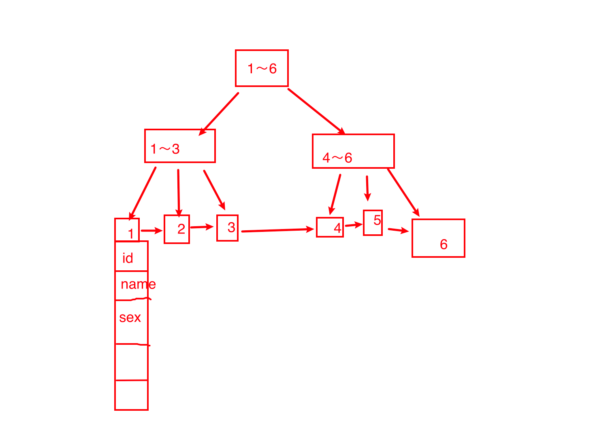

## PHP模块

### 1.php有哪几种设计模式？

1.工厂模式

通过方法或函数，去生成对象。而不是直接new。这样子的好处呢，就是可以统一在一个方法中创建对象，比较方便的管理类的实例化。比如在thinkphp5.1中的Loader类中的factory方法。在框架底层时实例化数据库的场景，就是通过工厂模式给工厂方法传递对应的参数，实例化不同数据库类，比如mysql，pgsql，sqlserver类等。实现对不同类型的数据库进行统一管理。

以前需要一个对象时，就直接new。	现在传入参数给工厂类，让工厂类生产出对象给你。


2.单例模式

对于某个类来说，这个类只允许存在一个对象，防止造成资源的浪费。比如数据库连接对象，或者模型类的对象。

3.注册树模式

在项目中类实例化后的对象，会统一注册到一个全局变量中，在需要用某个对象时，直接去全局变量中取即可。就像tp框架中的容器，容器就用到了注册模式，将项目中的对象，统一用容器来管理。


4.策略模式。比如要根据不同的年级，展示不同的数据。此时1到6年纪的话。一般的做法就是封装一个类方法，方法中做6个判断，如果参数等于一年级 ， 进一个判断再处理一年级的业务逻辑。其他年级的同理。此时这个方法6个判断，判断里面有不同的业务代码，此方法就比较繁琐和臃肿。
此时就可以使用策略模式，把6个判断的业务逻辑封装成6个类方法 然后，新建一个类的统一方法，方法中的参数传入一个类对象和数据。然后直接类对象的方法。这样6个判断一大堆代码，就简化成了2，3行代码，以后还要新增多少个判断时，就只需要新增多少个类 ，就比较好维护了。


5.适配器模式


6.观察者模式


### 2.php如何如何与nginx通信的？


### 3.常见的字符串操作函数


### 4.php常见的数组操作函数？


### 5.如何设计一个合理的api接口？


### 5.1如何保证接口的幂等性？

问题的场景

**1、前端重复提交**

用户注册，用户创建商品等操作，前端都会提交一些数据给后台服务，后台需要根据用户提交的数据在数据库中创建记录。如果用户不小心多点了几次，后端收到了好几次提交，这时就会在数据库中重复创建了多条记录。这就是接口没有幂等性带来的 bug。

**2、接口超时重试**

对于给第三方调用的接口，有可能会因为网络原因而调用失败，这时，一般在设计的时候会对接口调用加上失败重试的机制。如果第一次调用已经执行了一半时，发生了网络异常。这时再次调用时就会因为脏数据的存在而出现调用异常。

**3、消息重复消费**

在使用消息中间件来处理消息队列，且手动 ack 确认消息被正常消费时。如果消费者突然断开连接，那么已经执行了一半的消息会重新放回队列。

当消息被其他消费者重新消费时，如果没有幂等性，就会导致消息重复消费时结果异常，如数据库重复数据，数据库数据冲突，资源重复等。


1.在请求参数中，增加一个请求的唯一标识，比如加个token,比如下单接口应该保证幂等行时，每次下单前，后端给前端带一个token，当后端收到请求时，在redis中马上删掉此次请求的token.第二次token来的时候，后端发现没有对应的token，则代表此请求已经被处理过了，直接返回成功即可。

2.对请求的某个唯一性字段进行枷锁，比如redis的分布式锁，多个相同的请求过来时，只有第一个请求可以成功处理，其他请求直接返回，保证幂等性。

3.插入某些资源时，先查询一遍数据库，如果发现已有对应的记录，则直接返回成功。如果没有资源，才继续往下执行。

4.**唯一请求标识符**：每个请求应该包含一个唯一的标识符，通常是一个请求头或请求参数中的字段。服务器可以使用这个标识符来检测重复请求并处理它们。


### 6.php最新版本是多少？有什么新特性吗？

1.Php8，引入了JIT编译引擎，在性能上提示了3倍左右。


2.联合类型,int|float


3.match关键字，可简化switch结构


4.新增类型mixed类型，混合类型。

等等还有其他的。大体上更新后，php的性能更能高了，其语法也更规范化了。


### 7.include和require区别？

1.include会在用到时文件时才引入。require是一开始就引入。

比如

```php
if ($res === true) {
  include "./demo.php";//只有当res 为true时才会引入文件。
}

if ($res === true) {
  require "./demo.php";//不管res是啥，都会引入文件。
}
```


2.include引入文件的代码如果有错误时，程序会继续往下执行。require会报错停止程序的执行。


**include_once**()和**require_once()**语句也是在脚本执行期间包括运行指定文件。此行为和include()语句及require()类似，使用方法也一样。唯一区别是如果该文件中的代码已经被包括了，则不会再次包括。这两个语句应该用于在脚本执行期间，同一个文件有可能被包括超过一次的情况下，确保它只被包括一次，以避免函数重定义以及变量重新赋值等问题。


### 8.抽象类和普通类有什么区别？

抽象类不能被实力化。只能被继承。继承的子类必须要实现抽象类的方法。

### 9.抽象方法和普通方法有什么区别？


所谓的抽象方法就是在普通的方法前使用==abstract==修饰，但抽象方法不能有方法体"{}"

```php
abstract class A{
    public function demo()
    {

    }

    abstract public function test();
    
    //不能写成,因为不能有{}
    //abstract public function test() {
        
    //};
}

class B extends A {
    public function test()
    {
        return '123';
    }

}
var_dump((new B)->test());
```

如果子类继承的抽象类，就必须将抽象方法补充完整(实现)。或者子类也声明为抽象类

如果一个类中包含抽象方法，那么这个类就必须声明为抽象类。


### 10接口和抽象类有什么区别？

类似于接口。但一个类可以一次性实现多个接口。而抽象类只能单继承，要实现多继承的抽象类的话，只能通过链式继承来实现，比接口要繁琐一点。


## Thinkphp模块

### 1.生命周期是什么？


### 2.中间件实现的原理是什么？


### 3.用到了什么设计模式？


### 4.tp5.1中的容器和门面分别是什么？

容器：项目在运行过程中，会把很多类实例化出很多对象，容器就是统一管理这些对象的一个角色。作用：实现类的统一管理，确保对象实例的唯一性。

门面：门面是调用容器对象的一个入口。门面功能可以让类无需实例化而直接进行静态方式调用。


5.谈谈你对tp框架的理解？


## redis模块

### 1.redis和memcacha的区别？

1.redis支持数据持久化，而memcache不可以。
2.redis支持5中数据类型，而且memcache只支持字符串类型的存储。
3.占用的端口号不同，MemCache用的是11211，redis用的是6379
4.redis操作具有原子性，并发情况下可以保证数据一致性。


### 2.redis的发布与订阅模式的有什么缺点吗？

订阅者如果先订阅了，后离开，在此订阅时，得不到离开后产生的消息。

有什么措施可以解决这个问题呢？

在发消息时，做一个消息的记录。得不到消息时，可以去对应的记录里面找


### 3.redis如何实现持久化？


### 4.两种持久化方式有什么不同？


5.redis有什么架构模式

1.单机模式。

缺点

1、内存容量有限 2、处理能力有限 3、无法高可用。

2.主从复制模式。

一主多从

优点：将读数据转交从库，降低 master 读压力

缺点：无法保证高可用，没有解决 master 写的压力

3.哨兵模式

Redis sentinel 是一个分布式系统中监控 redis 主从服务器，并在主服务器下线时自动进行故障转移。其中三个特性：

监控（Monitoring）：  Sentinel 会不断地检查你的主服务器和从服务器是否运作正常。

提醒（Notification）： 当被监控的某个 Redis 服务器出现问题时， Sentinel 可以通过 API 向管理员或者其他应用程序发送通知。

自动故障迁移（Automatic failover）： 当一个主服务器不能正常工作时， Sentinel 会开始一次自动故障迁移操作。

优点：特点：

1、保证高可用

2、监控各个节点

3、自动故障迁移

缺点：主从模式，切换需要时间丢数据，没有解决 master 写的压力


### 5.**使用过Redis分布式锁么，它是怎么实现的？** 

先拿setnx来争抢锁，抢到之后，再用expire给锁加一个过期时间防止锁忘记了释放。

**如果在setnx之后执行expire之前进程意外crash或者要重启维护了，那会怎么样？**

set指令有非常复杂的参数，这个应该是可以同时把setnx和expire合成一条指令来用的！

set(key ,value, time)


### 6什么是缓存穿透？如何避免？

一般的缓存系统，都是按照key去缓存查询，如果不存在对应的value，就应该去后端系统查找（比如DB）。一些恶意的请求会故意查询不存在的key,请求量很大，就会对后端系统造成很大的压力。这就叫做缓存穿透。

如何避免？

1.接口层增加校验（接口做验签），用户请求限制次数，id做基础校验，id<=0的直接拦截；

2。缓存空值

之所以会发生穿透，就是因为缓存中没有存储这些空数据的key。从而导致每次查询都到数据库去了。

那么我们就可以为这些key对应的值设置为null 丢到缓存里面去。后面再出现查询这个key 的请求的时候，直接返回null 。

这样，就不用在到数据库中去走一圈了，但是别忘了设置过期时间。


3.2 BloomFilter

BloomFilter 类似于一个hbase set 用来判断某个元素（key）是否存在于某个集合中。

这种方式在大数据场景应用比较多，比如 Hbase 中使用它去判断数据是否在磁盘上。还有在爬虫场景判断url 是否已经被爬取过。

针对于一些恶意攻击，攻击带过来的大量key 是不存在的，那么我们采用第一种方案就会缓存大量不存在key的数据。

这种方案可以加在第一种方案中，在缓存之前在加一层 BloomFilter ，在查询的时候先去 BloomFilter 去查询 key 是否存在，如果不存在就直接返回，存在再走查缓存 -> 查 DB。


此时我们采用第一种方案就不合适了，我们完全可以先对使用第二种方案进行过滤掉这些key。

针对这种key异常多、请求重复率比较低的数据，我们就没有必要进行缓存，使用第二种方案直接过滤掉。

而对于空数据的key有限的，重复率比较高的，我们则可以采用第一种方式进行缓存。


### 7.**缓存击穿，如何避免**？

缓存击穿是指缓存中没有但数据库中有的数据（一般是缓存时间到期），这时由于并发用户特别多，同时读缓存没读到数据，又同时去数据库去取数据，引起数据库压力瞬间增大，造成过大压力

如何避免？

1. 设置热点数据永远不过期。

2. 通过计划任务主动查询数据库，并将数据写入redis中,保证redis永远都会有数据存在。

   

### 8什么是缓存雪崩？何如避免？

```
缓存雪崩的情况是说，当某一时刻发生大规模的缓存失效的情况，会有大量的请求进来直接打到DB上面。结果就是DB 称不住，挂掉
```

缓存击穿的区别就是，缓存击穿时描述**一个key**的情况。热点数据key的情况。

缓存雪崩时，大量不同的key过期了，很多请求直接打到数据库。


1.错开缓存数据的过期时间，防止同一时间大量数据过期现象

2.限流，如果当前请求超过一定数量，就不查询DB了，保证mysql不会因大量请求直接挂掉

3.缓存双层降级策略：当缓存C1失效时，请求缓存备份C2，C1失效时间短，C2失效时间长

## 	mysql模块

### 1.mysql如何优化？


## mysql索引模块

### 1.mysql中索引的实现方法有哪些？

b-tree和hash

因为Hash索引底层是哈希表，哈希表是一种以key-value存储数据的结构，所以多个数据在存储关系上是完全没有任何顺序关系的，所以，对于区间查询是无法直接通过索引查询的，就需要全表扫描。***\*所以，哈希索引只适用于等值查询的场景。\****而B+ 树是一种多路平衡查询树，所以他的节点是天然有序的（左子节点小于父节点、父节点小于右子节点），所以对于范围查询的时候不需要做全表扫描

B-Tree索引和Hash索引区别？

哈希索引适合等值查询，但是无法进行范围查询 

哈希索引没办法利用索引完成排序 

哈希索引不支持多列联合索引的最左匹配规则 

如果有大量重复的情况下，哈希索引的效率会很低，因为存在哈希碰撞问题

### 2.b-tree和b+tree的区别？


b-tree上内部节点可以存键和值。但b+tree中，内部节点只可以存键，不能存值

btree的叶子节点中，是相互独立的。而b+tree中的叶子节点有一条链相连

5，15，20是内部节点


B树可以在内部节点同时存储键和值，因此，把频繁访问的数据放在靠近根节点的地方将会大大提高热点数据的查询效率。这种特性使得B树在特定数据重复多次查询的场景中更加高效。


B+树的叶子节点有一条链，而B树的叶子节点各自独立。

因此，当需要进行一次全数据遍历的时候，b+tree会直接通过链拿到数据，不需要去扫描内部节点。


由于B+树的内部节点只存放键，不存放值，因此，一次读取，可以在内存页中获取更多的键，有利于更快地缩小查找范围。 B+树的叶节点由一条链相连，因此，当需要进行一次全数据遍历的时候，B+树只需要使用O(logN)时间找到最小的一个节点，然后通过链进行O(N)的顺序遍历即可。而B树则需要对树的每一层进行遍历，这会需要更多的内存置换次数，因此也就需要花费更多的时间

### 3.数据库为什么使用b+tree，不使用b-tree树呢？

B树只适合随机检索，而B+树同时支持随机检索和顺序检索；

b+tree可以减少io次数，有更稳定的查询效率


### 4。什么是聚簇索引？何时使用聚簇索引与非聚簇索引

聚簇索引：将数据存储与索引放到了一块，找到索引也就找到了数据

非聚簇索引：将数据存储于索引分开结构，索引结构的叶子节点指向了数据的对应行，myisam通过key_buffer把索引先缓存到内存中，当需要访问数据时（通过索引访问数据），在内存中直接搜索索引，然后通过索引找到磁盘相应数据，这也就是为什么索引不在key buffer命中时，速度慢的原因

### 5.红黑树是啥？为什么数据库不用红黑树，使用b+树呢？

红黑树是每个节点都带有颜色属性的二叉查找树，颜色或红色或黑色。


红黑树的节点可以通过一定的旋转，加快新增和插入数据的效率，更适合大量插入和新增数据的场景。


既然红黑树搜索效率也高，为什么数据库使用b+树，这是因为红黑树仍然是一棵二叉树，相同数量的节点，红黑树更深，不适用与磁盘的IO。


在数据库中除了新增和修改擦，相对来说更多场景是查询，而且b树/b+树是多路平衡查找树，在相同节点的情况下，b树的高度远小于红黑树，高度越小，磁盘的io的时间就更少。查找数据时，b树会比红黑树查找的更快。

```
B/B+树是为了磁盘或其它存储设备而设计的一种平衡多路查找树(相对于二叉,B树每个内节点有多个分支),与红黑树相比,在相同的的节点的情况下,一颗B/B+树的高度远远小于红黑树的高度(在下面B/B+树的性能分析中会提到).B/B+树上操作的时间通常由存取磁盘的时间和CPU计算时间这两部分构成,而CPU的速度非常快,所以B树的操作效率取决于访问磁盘的次数,关键字总数相同的情况下B树的高度越小，磁盘I/O所花的时间越少.

二叉查找树的结构不适合数据库，因为它的查找效率与层数相关。越处在下层的数据，就需要越多次比较。对于数据库来说，每进入一层，就要从硬盘读取一次数据，这非常致命，因为硬盘的读取时间远远大于数据处理时间，数据库读取硬盘的次数越少越好。这种数据结构，非常有利于减少读取硬盘的次数。假定一个节点可以容纳100个值，那么3层的B树可以容纳100万个数据，如果换成二叉查找树，则需要20层！假定操作系统一次读取一个节点，并且根节点保留在内存中，那么B树在100万个数据中查找目标值，只需要读取两次硬盘。
```


### 6.大概画一下Btree树的结构




## mysql 集群模块

### 1.mysql主从复杂的原理是什么？

主数据库上开启bin-log日志后，将修改数据的sql写入到bin-log文件中。然后从服务器配置好主从后，会有两个进程一直监听主库的bin-log日志。当操作数据库时，就会把sql同步到从库上，让从库去执行，从而保证主库和从库的数据一致性

### 2.mysql主从复制中，主库或从挂了怎么办？

用MHA即可。

mha

MHA（Master High Availability）目前在MySQL高可用方面是一个相对成熟的解决方案，它由日本DeNA公司youshimaton（现就职于Facebook公司）开发，是一套优秀的作为MySQL高可用性环境下故障切换和主从提升的高可用软件。在MySQL故障切换过程中，MHA能做到在0~30秒之内自动完成数据库的故障切换操作，并且在进行故障切换的过程中，MHA能在较大程度上保证数据的一致性，以达到真正意义上的高可用。

该软件由两部分组成：MHA Manager（管理节点）和MHA Node（数据节点）。MHA Manager可以单独部署在一台独立的机器上管理多个master-slave集群，也可以部署在一台slave节点上。MHA Node运行在每台MySQL服务器上，MHA Manager会定时探测集群中的master节点，当master出现故障时，它可以自动将数据的slave提升为新的master，然后将所有其他的slave重新指向新的master。整个故障转移过程对应用程序完全透明。

在MHA自动故障切换过程中，MHA试图从宕机的主服务器上保存二进制日志，较大程度的保证数据的不丢失，但这并不总是可行的。例如，如果主服务器硬件故障或无法通过ssh访问，MHA没法保存二进制日志，只进行故障转移而丢失了的数据。使用MySQL 5.5的半同步复制，可以大大降低数据丢失的风险。MHA可以与半同步复制结合起来。如果只有一个slave已经收到了的二进制日志，MHA可以将的二进制日志应用于其他所有的slave服务器上，因此可以保证所有节点的数据一致性


如果主库挂了，mha监控到的话，会有一套选举机制，选出一个从库出来当主库。其他从库，都链接新的主库。


### 3.主从同步的速度太慢了怎么办？

慢慢排查问题原因，有可能的原因？

1.网络

网络可能导致主从延迟的问题，比如主机或者从机的带宽打满、主从之间网络延迟很大，有可能会导致主上的binlog没有全量传输到从机，造成延迟。

我的那组DB的IO线程已经将对应的binlog近乎实时的拉取到了从机DB上，基本排除网络导致的延迟。还可以结合网络质量相关监控来进一步确认是网络的问题。

#### 2.机器性能

从机使用了烂机器？之前有遇到过有的业务从机使用了很烂的机器，导致的主从延迟。比如主机使用SSD而从机还是使用的SATA。从机用烂机器的观念需要改改，随着DB自动切换的需求越来越高，尤其是我所在的金融行业，从机至少不要比主机配置差。

从机高负载？有很多业务会在从机上做统计，把从机服务器搞成高负载，从而造成从机延迟很大的情况，这种使用top命令即可快速发现。

从机磁盘有问题？磁盘、raid卡、调度策略有问题的情况下，有的时候会出现单个IO延迟很高的情况，比如raid卡电池充放电的时候，在没有设置强行write back的情况下得会将write back模式修改为write through。使用iostat命令查看DB数据盘的IO情况，是否是单个IO的执行时间很长，块大小和磁盘队列情况等，可以比较一下DB盘的IO调度规则以及块大小的设置等。使用iostat查看IO运行情况：

从IO情况看也没什么问题，单个IO延迟很小，iops很低，写带宽也不大。调度规则（cat /sys/block/fioa/queue/scheduler）和块大小等和主机设置是一样的，排除磁盘的问题。

从运行指标看，机器负载很低，机器性能也可以排除。

#### 大事务

是否是经常会有大事务？这个可能广大DBA们会遇到比较多，比如在RBR模式下，执行带有大量的delete操作，或者在MBR模式下删除的时候添加了不确定语句（类似limit），又或者一个表的alter操作等，都会导致延迟情况的发生。这种通过查看processlist相关信息以及使用mysqlbinlog查看binlog中的SQL就能快速进行确认。这个设想也被排除。


#### 锁

锁冲突问题也可能导致从机的SQL线程执行慢，比如从机上有一些select .... for update的SQL，或者使用了MyISAM引擎等。此类问题，可以通过抓去processlist以及查看information_schema下面和锁以及事务相关的表来查看。

经过排查也并未发现锁的问题。

在遇到主从延迟的问题的时候，可以从如下几个地方开脑洞，寻找蛛丝马迹，找到问题的根源，对症下药，药到病除，排查范围包括但不限于如下几方面：

网络方面

性能方面

配置方面（参数优化）

大事务

锁

多线程复制

组提交


## 高可用，高并发类的问题？


1.如何设计一个高可用，高性能的一个接口？

符合restful规范的接口。

高可用:后端的数据库和缓存层都搭建集群结构，防止单一节点故障，导致整体服务不可用。

web层，进行nginx的负载均衡的搭建，防止单一节点故障。

对集群架构进行监控和预警，出现故障情况时，及时进行数据恢复和故障转移。

对流量进行限流。对整体流量进行一个限流，当超过某个qps时，拒绝其他流量的访问，防止服务崩溃而影响全部用户。

对恶意多次访问的ip进行拉黑，拉入黑名单拒绝其访问。

对一些第三方的服务，进行监控和预警，当第三方服务时崩溃时，可以及时通知我们进行，处理。而不是等到大部分用户反馈问题后，才处理。


高性能方面的话，

可以在接口层引入缓存层，增加数据的查询效率。

引入消息中间件，对业务处理进行加速，比如某些可以异步的场景，把消息塞入队列中，后直接返回，不用等待再那里。

对数据库查询的sql进行分析，找出慢sql，进行对应的优化，提高查询的效率。


2.设计一个架构，可用抗住上亿流量级别的架构？

前端方面的话，合并css和js文件。减少http请求，对前端资源进行缓存和走cdn加速。

后端的话，加入缓存层,加入消息队列，优化好慢sql，调整机器参数，

数据库和缓存层 都搭建主从复制的集群架构。在web层也搭建一个nginx的负载均衡架构

3.高并发下如何保证一致性？

4.如何接口响应很慢，如何处理？


5.get和post有什么区别？

6.什么是tcp3次握手和4次挥手？


7.设计模式有哪几种，有哪些应用场景？

单例模式，工厂模式，适配器模式，责任链模式，注册树模式。


8.mysql有什么索引类型？之间有什么区别？

9.mysql


10 redis的持久化机制有哪些，分别有什么区别？


11.缓存穿透，缓存击穿，缓存雪崩分别是什么？如果解决呢？

12.mysql主从复制中，主库或从挂了怎么办？

13.php如何如何与nginx通信的？

14.说出thinkphp框架的生命周期

15mysql和redis数据不一致。

redis引入canal组件来订阅mysql的binlog日志。


16.cookie和session有什么区别？

1


