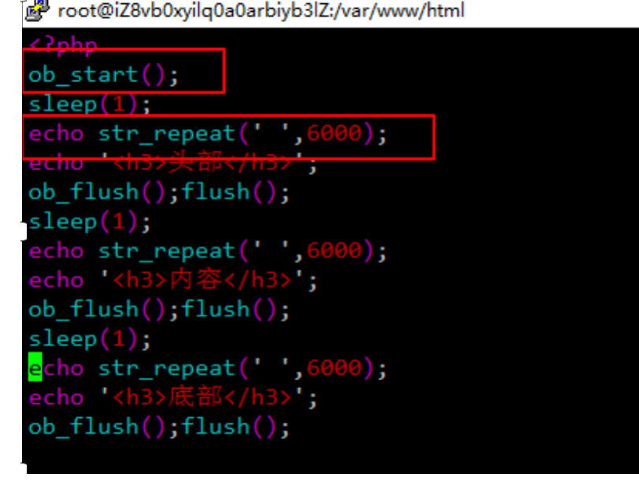
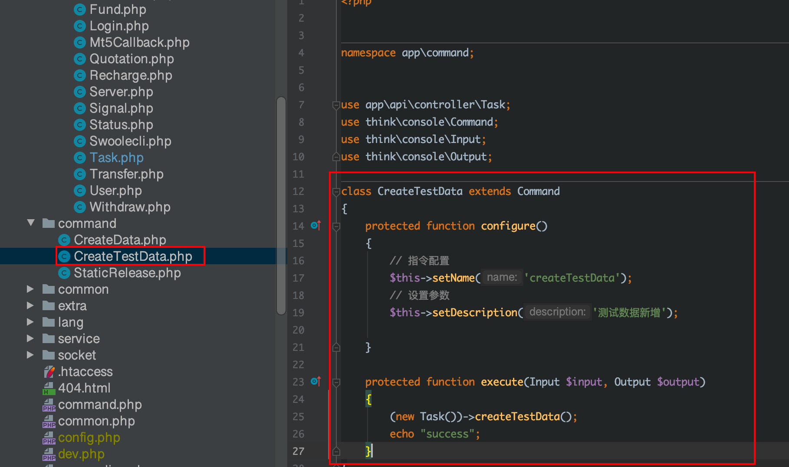
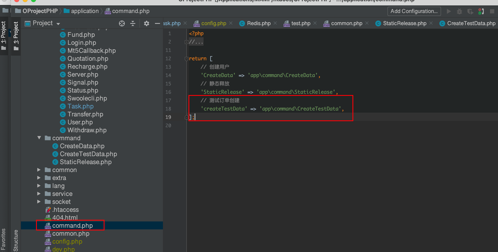
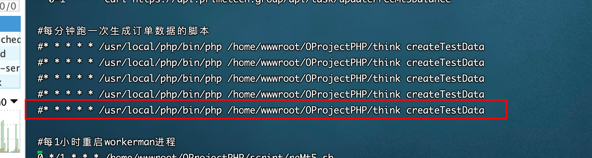
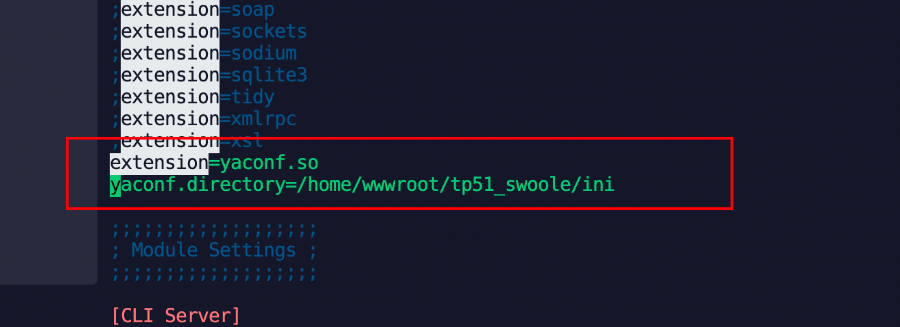
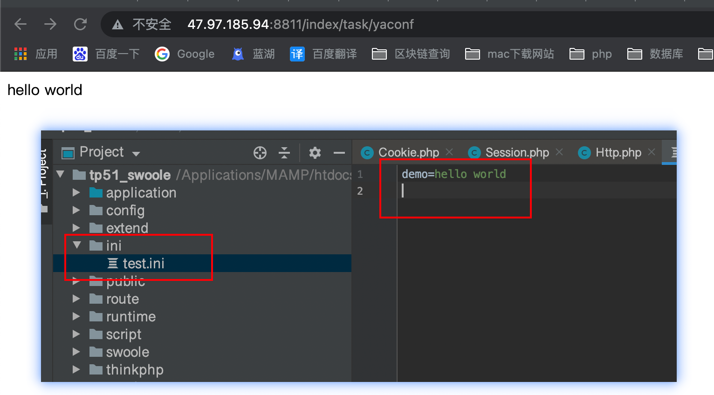
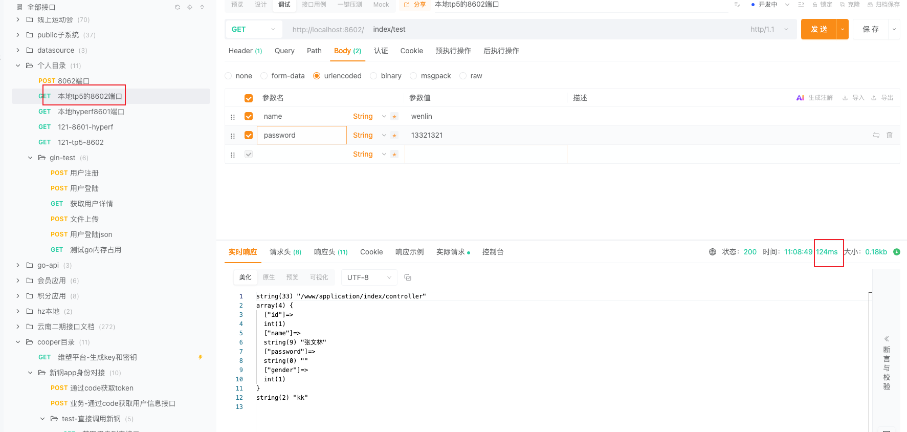
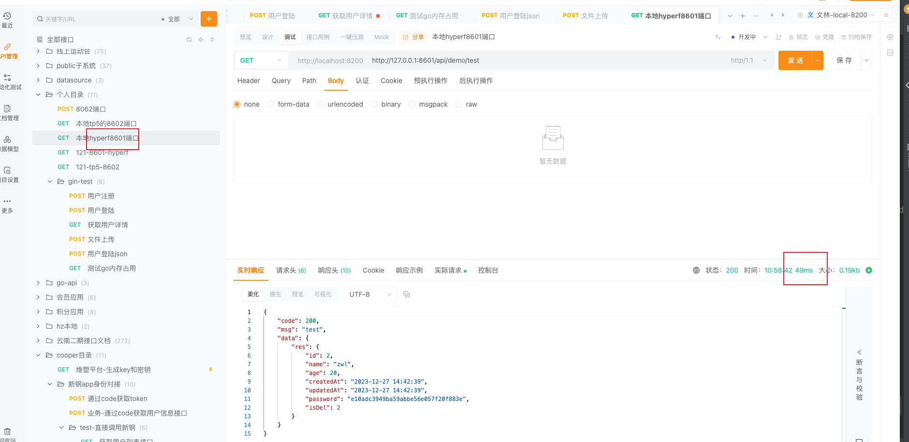
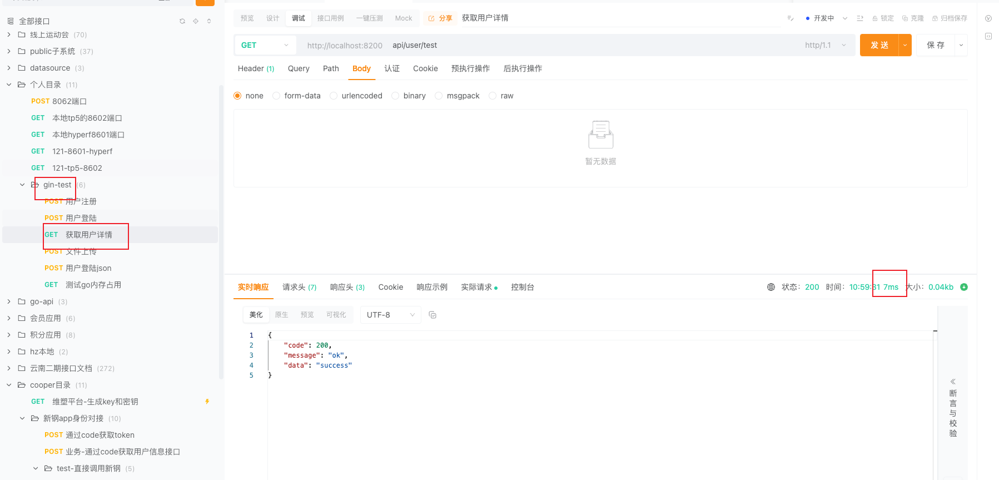

### 1.静态化

浏览器访问静态文件的速度，是访问动态文件速度的30倍，适合不经常变化的页面。

静态化优点

1.不查询数据库，访问速度快，用户体验好。

2.不接收参数，安全性高。

3.静态化后，如果有需要，可以走cdn时，极大的提高访问速度。PS：动态文件也可以走cdn，意义就是可以隐藏真实ip，提高项目的安全性。

缺点

实时性差


使用file_put_contents函数，将信息写入html文件中。

```
1.静态化。将html字符串写入文件，然后访问时，访问对应的文件即可。
tp中可以将
return view（'index.html'）；
改为$html = view（'index.html'）；
然后将$html写入文件。即可生成静态文件
```

### 2.ob缓存

1.ob缓存，可以用来实现页面的分块显示。加强用户体验。

默认情况下，php会把输出的内容放到【程序缓存】中，待程序跑完，把【程序缓存】中的东西全部抛到浏览器中。

使用ob缓存后，所有的输出主体内容都会放到【ob缓存】中，头信息（header）等这些依旧存放到【程序缓存】中，待程序跑完，【ob缓存】中的内容会被放到【程序缓存】中，再送到浏览器。

```
ob函数
ob_start() 开启
ob_get_contents()  获取缓存中的数据
ob_clean()  清空缓存中的数据
ob_end()    关闭ob缓存
ob_end_clean() 清空缓存并关闭ob缓存
ob_flush()  刷新缓冲区,  ob缓存     程序缓存
flush() 把程序缓存内容推送到浏览器

bigpipe使用ob来实现，分块化展示页面
nginx中要想着到前端逐个块展示，需要进行nginx如下配置
【nginx.conf中】
proxy_buffering off;
gzip off;
fastcgi_keep_conn on;

分块展示的简单例子如下
```



### 3.当需要跑一些时间较长的脚本时，直接curl 的方式去跑，会造成nginx超时。此时可以把脚本改成命令行的方式去跑

参考tp5.1中手册中自定义命令部分。







然后运行时，使用这样的命令。就可以避免nginx超时的问题。

/usr/local/php/bin/php /home/wwwroot/OProjectPHP/think createTestData


### 4.代码加载配置文件时使用yaconf加载。

鸟哥yaconf的文章说明：https://www.laruence.com/2015/06/12/3051.html

Yaconf要求PHP7才能用

yaconf时鸟哥，写的一款高性能的配置文件读取扩展。读取后的配置文件信息，会常驻内存。多个进程共用，比传统的php数组形式性能要好很多。

**注意点**：因为常驻内存，所以每次修改配置文件后，需要重启php，才能加载到最新的配置文件。

安装yaconf扩展

然后使用php -m查看是否加载到。

然后需要在php.ini文件中，配置ini文件到路径



然后重启php服务。即可生效。

在代码中这样使用即可获取到指定目录下的ini文件。

```php
$res = \Yaconf::get("test.demo");

```




### 5 tp5 gin hyperf版本运行性能对比


1.都是在一个接口内，执行查询数据库操作和查询redis数据操作


Tp5.1 版本的接口响应时间在 70ms ～ 90ms之间




hyperf 2.2.3版本在 30ms ～ 60ms之间波动




gin v1.9.1 在7ms～25ms之间波动


