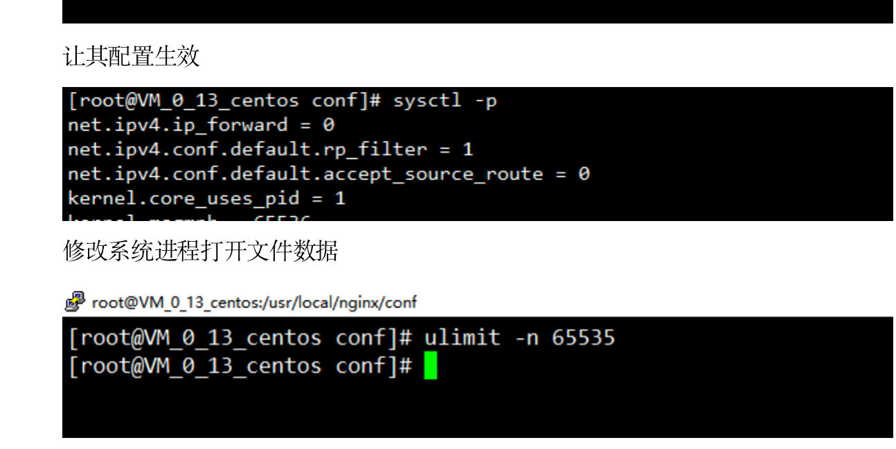
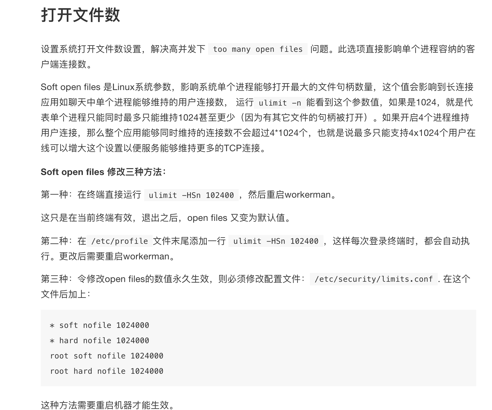

# 服务器方面

## 1.nginx配置优化

```nginx
# 指明了nginx要开启的进程数  一般为当前机器总cpu核心数的1到2倍
worker_processes    2;
# 配置Nginx worker进程最大打开文件数
worker_rlimit_nofile 65535;

events {
    # 单个进程允许的客户端最大连接数
    worker_connections  30000；
}

http {
    # Nginx去除版本号
    server_tokens off;
    
    # 设置客户端连接保持会话的超时时间,超过这个时间,服务器会关闭连接
	keepalive_timeout 10;
    
    # 指定连接到后端Fastcgi的超时时间(单位:秒)
    fastcgi_connect_timeout 300;

    # 向Fastcgi传送请求的超时时间,这个值是指已经完成两次握手后向Fastcgi传送请求的超时时间(单位:秒)
    fastcgi_send_timeout 300;

    # 指定接收Fastcgi应答的超时时间,这个值是指已经完成两次握手后接收Fastcgi应答超时时间(单位:秒)
    fastcgi_read_timeout 300;
}
```


## 2.Gzip压缩

```nginx
## http 节点中设置

gzip            on;
# 设置将被gzip压缩的响应的最小长度,单位是字节,一般在500和1000之间
gzip_min_length 700;
# 压缩级别 1-9
gzip_comp_level 6;
# 压缩在缓冲区块数和每块大小
gzip_buffers 32 4k | 16 8k;
# 设置压缩响应所需的最低HTTP请求版本
gzip_http_version 1.0 | 1.1;
gzip_types      text/plain text/html text/css text/xml application/xml application/json application/javascript;
# 给CDN和代理服务器使用，针对相同url，可以根据头信息返回压缩和非压缩副本
gzip_vary on;
```


## 3.浏览器缓存

```nginx
## 设置在 server 中的 location 节点
# expires 1s  秒 
# expires 2m  分
# expires 3h  时
# expires 6d  天

location ~* \.(jpg|jpeg|gif|bmp|png|ico|svg|mp4|mp3){
    expires 1d; # 缓存1天
}
```


## 4.图片防盗链

```nginx
location ~* \.(jpg|jpeg|gif|bmp|png|ico|svg|mp4|mp3)$ {
    valid_referers none blocked *.1314000.cn 1314000.cn;
    if ($invalid_referer) {
        return 403;
    }
}
```


## 5.Linux服务器参数优化

```nginx
# 修改 vi /etc/sysctl.conf   内核文件
net.core.somaxconn = 10000  允许等待中的监听
net.ipv4.tcp_tw_recycle = 1  tcp连接快速回收
net.ipv4.tcp_tw_reuse = 1    tcp连接重用   
net.ipv4.tcp_syncookies = 0  不抵御洪水攻击
net.ipv4.tcp_fin_timeout = 10 修改系統默认的 TIMEOUT 时间 秒
net.ipv4.tcp_keepalive_time = 300  TCP发送keepalive消息的频度 秒

net.core.somaxconn = 10000 
net.ipv4.tcp_tw_recycle = 1 
net.ipv4.tcp_tw_reuse = 1 
net.ipv4.tcp_syncookies = 0 
net.ipv4.tcp_fin_timeout = 10 
net.ipv4.tcp_keepalive_time = 300


#该参数设置系统的TIME_WAIT的数量，如果超过默认值则会被立即清除
net.ipv4.tcp_max_tw_buckets = 20000
#定义了系统中每一个端口最大的监听队列的长度，这是个全局的参数
net.core.somaxconn = 65535
#对于还未获得对方确认的连接请求，可保存在队列中的最大数目
net.ipv4.tcp_max_syn_backlog = 262144
#在每个网络接口接收数据包的速率比内核处理这些包的速率快时，允许送到队列的数据包的最大数目
net.core.netdev_max_backlog = 30000
#能够更快地回收TIME-WAIT套接字。此选项会导致处于NAT网络的客户端超时，建议为0
net.ipv4.tcp_tw_recycle = 0
#系统所有进程一共可以打开的文件数量
fs.file-max = 6815744
#防火墙跟踪表的大小。注意：如果防火墙没开则会提示error: "net.netfilter.nf_conntrack_max" is an unknown key，忽略即可
net.netfilter.nf_conntrack_max = 2621440
运行 sysctl -p即可生效。

# 让内核参数生效
sysctl -p

# 设置所有程序可以同时打开的文件数量
ulimit -n 65535
```






## 6.服务器做负载均衡

用nginx做负载均衡。


## 7.php-fpm配置优化

1.php.ini 和 php-fpm.conf的区别。

其实是php和php-fpm的两者的区别，php-fpm是fastcgi php mangent ,php-fpm是php-cgi的一个管理程序，可以将请求动态的分配给对应的php-cgi程序处理。 而php-fpm.conf就是定义了这个管理php-cig程序的配置，比如php-fpm的进程管理方式是动态还是静态等配置。这就是两者的区别。


php.ini是php的配置文件，里面定义php自身的各项配置，比如php开启的扩展,php运行等内存大小等信息。

而php-fpm.conf文件的话，定义的是和php-fpm和nginx的交互	


### 表示使用哪种进程数量管理方式

pm = dynamic; 表示使用哪种进程数量管理方式

#### 动态：

dynamic表示php-fpm进程数是动态的，最开始是pm.start_servers指定的数量，如果请求较多，则会自动增加，保证空闲的进程数不小于pm.min_spare_servers，如果进程数较多，也会进行相应清理，保证多余的进程数不多于pm.max_spare_servers

#### 静态：

static表示php-fpm进程数是静态的, 进程数自始至终都是pm.max_children指定的数量，不再增加或减少


### 配置

　　pm.max_children = 300; **静态方式**下开启子进程(php-cgi进程)的数量。

设置数量的方式：一般来说一台服务器正常情况下每一个php-cgi所耗费的内存在20M~30M左右，因此我的”max_children”我设置成40个，20M*40=800M也就是说在峰值的时候所有PHP-CGI所耗内存在800M以内，低于我的有效内存2Gb。

　　pm.start_servers = 20; **动态方式**下的起始子进程数量
　　pm.min_spare_servers = 5; **动态方式**下的最小子进程数量
　　pm.max_spare_servers = 35; **动态方式**下的最大子进程数量


　　　　如果pm为static, 那么其实只有pm.max_children这个参数生效。系统会开启设置数量的子进程

　　　　如果pm为dynamic, 那么pm.max_children参数失效，后面3个参数生效。系统会在php-fpm运行开始的时候启动pm.start_servers个php-fpm进程，然后根据系统的需求动态在pm.min_spare_servers和pm.max_spare_servers之间调整php-fpm进程数


说明

　　　　那么，对于我们的服务器，选择哪种pm方式比较好呢？事实上，跟Apache一样，运行的PHP程序在执行完成后，或多或少会有内存泄露的问题。这也是为什么开始的时候一个php-fpm进程只占用3M左右内存，运行一段时间后就会上升到20-30M的原因了。

　　　　对于内存大的服务器（比如8G以上）来说，指定静态的max_children实际上更为妥当，因为这样不需要进行额外的进程数目控制，会提高效率。因为频繁开关php-fpm进程也会有时滞，所以内存够大的情况下开静态效果会更好。数量也可以根据 内存/30M 得到，比如8GB内存可以设置为100，那么php-fpm耗费的内存就能控制在 2G-3G的样子。如果内存稍微小点，比如1G，那么指定静态的进程数量更加有利于服务器的稳定。这样可以保证php-fpm只获取够用的内存，将不多的内存分配给其他应用去使用，会使系统的运行更加畅通。

　　　　对于小内存的服务器来说，比如256M内存的VPS，即使按照**一个20M**的内存量来算，10个php-cgi进程就将耗掉200M内存，那系统的崩溃就应该很正常了。因此应该尽量地控制php-fpm进程的数量，大体明确其他应用占用的内存后，给它指定一个静态的小数量，会让系统更加平稳一些。或者使用动态方式，因为动态方式会结束掉多余的进程，可以回收释放一些内存，所以推荐在内存较少的服务器或VPS上使用。具体最大数量根据 内存/20M 得到。比如说512M的VPS，建议pm.max_spare_servers设置为20。至于pm.min_spare_servers，则建议根据服务器的负载情况来设置，比较合适的值在5~10之间。

　　　　在4G内存的服务器上200就可以(**我的1G测试机，开64个是最好的**，建议使用压力测试获取最佳值)


### 防止内存泄露一定要配置pm.max_requests 

　　pm.max_requests = 20480; 请求数量达到多少后，自动重启一次php-fpm

　　　　nginx php-fpm配置过程中最大问题是内泄漏出问题：服务器的负载不大，但是内存占用迅速增加，很快吃掉内存接着开始吃交换分区，系统很快挂掉！其实根据官方的介绍，php-cgi不存在内存泄漏，每个请求完成后php-cgi会回收内存，但是不会释放给操作系统，这样就会导致大量内存被php-cgi占用。
官方的解决办法是降低PHP_FCGI_MAX_REQUESTS的值，如果用的是php-fpm，对应的php-fpm.conf中的就是max_requests，该值的意思是发送多少个请求后会重启该php-fpm。

我们需要适当降低这个值，用以让php-fpm自动的释放内存，不是大部分网上说的51200等等，实际上还有另一个跟它有关联的值max_children，这个是每次php-fpm会建立多少个进程。


　　request_terminate_timeout = 30;

最大执行时间, 在php.ini中也可以进行配置(max_execution_time)


　　request_slowlog_timeout = 2; 开启慢日志

　　slowlog = log/$pool.log.slow; 慢日志路径


　　rlimit_files = 1024; 增加php-fpm打开文件描述符的限制


### 8.减少前端的http请求

1.每个把小图标都是一个http请求。可以把合成为一张大图片，把多个图标的请求合成为一个请求。

2.js，css文件拼接，把这些文件合并压缩成一个文件，传输从而减少http的请求。


# 数据库方面

## 1.数据库做读写分离

缓解数据库io压力

## 2.数据库配置调优


